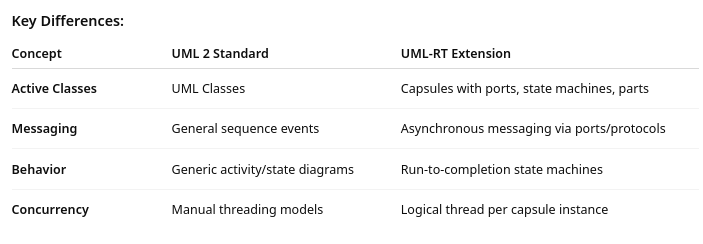
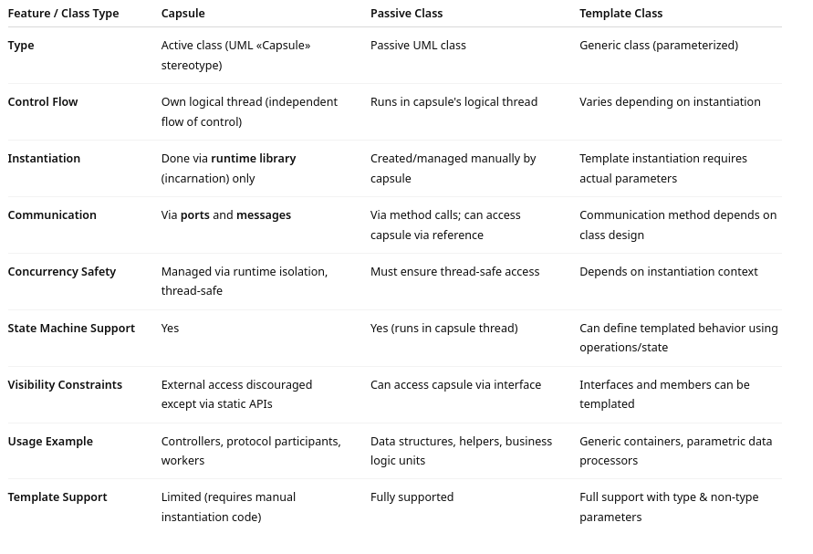
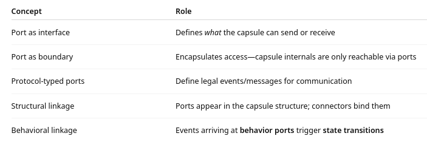
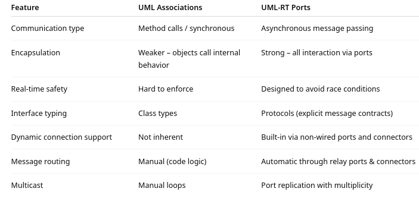
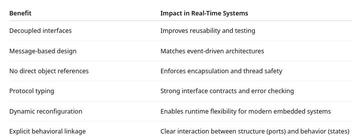
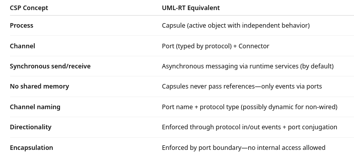

# 2 Modeling Fundamentals

This section will draw heavily on the document `1. Modeling Basics.pdf` in folder `Resources->Modeling Basics`

Some parts of this and other documents cited are reproduced here to provide continuity of material in presentation

--- 

## UML-RT
  
UML-RT is a constrained subset of UML 2 tailored for modeling real-time, embedded, and reactive systems.

This specification is also included in the same folder as `2.UML Specification SDL-RT.pdf`


### Key Differences: 



UML-RT includes stereotypes like «Capsule», «Protocol», and «InEvent» for semantic specificity.


### The Structure of a Real-Time Model

An RT model includes:
- Capsules – active components with their own control thread
- Passive Classes – supporting data structures
- Protocols – define typed messages for communication
- Ports & Connectors – route messages between components
- State Machines – define event-driven behavior
- Composite Structures – organize capsules into systems

---

## Capsule Summary

_Capsules_ 
  - are the primary building blocks in real-time models, representing active components with their own control flow.

_Active UML Object:_ 
- Unlike passive classes, capsules have an independent flow of control and are stereotyped with `«Capsule»`.

_Encapsulation_: 
- Capsules encapsulate structure (attributes, operations), behavior (state machines), and communication interfaces (ports).

_Instance Management_: 
- Capsule instances are created by the runtime service library using a process called `incarnation`.
- Instances are not created using the new operator
- They should not be passed around manually to avoid concurrency issues.

_Communication Model:_ 
- Direct access to capsule instances is discouraged.
- Interaction is message-based via ports and connectors, not direct method calls.
- Service ports define a capsule's external interface for event-based communication.

_Composite Structure:_
- Capsules can include other capsules (capsule parts) and define internal wiring using composite structure diagrams.
- Delegation and assembly connectors define internal and external communication paths.

_Behavior Definition:_
- Capsules can have state machines to define their behavior.
- Each capsule with a state machine has its own logical thread of control.

_Threading Model:_
- Logical threads can be mapped to physical threads transparently.
- Model design is not affected by how logical threads are physically executed.

_Design Recommendations:_
- Avoid sharing references to capsule instances across threads.
- Use static members for external access when necessary.
- Message routing and event handling ensure thread-safe design.

---

## Passive Class Summary

Passive classes are standard UML classes used to model data objects without their own control flow.
- Execute within the context (logical thread) of a capsule.

_Threading Behavior:_
- Do not have independent threads
- Rely on capsules for execution context.
- Need to avoid concurrent access from multiple logical threads to avoid race conditions

_Behavior Definition:_
- Can define behavior via state machines, similar to capsules.
- They can invoke operations on capsules if given a reference.

_Encapsulation and Access Control:_
- Recommended to pass capsule references through interfaces that expose only the necessary operations.
- This limits coupling and avoids misuse of capsule internals.

_Usage Guidance:_
- Capsules should manage the life cycle of their passive class instances.
- Passive classes are suitable for lightweight processing or data storage.

---

## Template Classes Summary

Template classes enable generic modeling—classes that vary by type or constant parameters.

_Types of Parameters:_
- _Type Template Parameters:_ Define a type that varies with context (e.g., a generic data holder).
- _Non-Type Template Parameters:_ Accept constants (e.g., array size).

_Diagram Representation:_
- Template parameters appear in the top-right corner of the class symbol.
- Syntax resembles C++ templates (e.g., T for type, att for constant).

_Usage Examples:_
- Customizable attribute types.
- Arrays with variable sizes.

_Capsule Template Limitation:_
- Capsules can be template classes, but instantiation must be manually coded in special runtime locations due to incarnation constraints.

_Defaults:_
- Both type and non-type parameters can have default values for convenience.

_Supported Elements:_
- Templates are also allowed for interfaces, type aliases, and operations, not just classes.

#### Template Example

- Buffer class that can store data of different types (e.g., integers, strings, or user-defined structs). 
- Useful for capsules or passive classes that need temporary storage for different types of messages.

```text
template<typename T, int Size>
class Buffer {
public:
    T data[Size];

    void put(int index, const T& value) {
        if (index >= 0 && index < Size)
            data[index] = value;
    }

    T get(int index) const {
        if (index >= 0 && index < Size)
            return data[index];
        return T(); // default constructed value
    }
};

```



---

## Protocol Summary

Protocol defines the communication contract between ports.
- Specifies the events (messages) that can be received (in-events) or sent (out-events).

Model Representation:
- Modeled as a UML «Protocol» stereotype applied to a UML Collaboration.
- Used as the type of port to define its allowed communication.

In-Events vs Out-Events:
- In-events: messages the capsule can receive.
- Out-events: messages the capsule can send.

Binary Protocols:
- Common pattern where the same protocol types two ports in a pairwise connection.
- One port is conjugated (denoted by ~) to swap in/out roles.
- Simplifies modeling bidirectional communication.

Visualization:
- In diagrams, protocols look like classes with listed in-events and out-events.
- Ports typed by a protocol clearly define the interaction surface of a capsule.

Usage in Capsules:
- Service ports are typed by protocols and form the external interface.
- Protocols ensure strong typing of inter-capsule communication.

Protocols and Ports:
- All ports must be typed by a protocol.
- Communication is always performed via message passing through ports conforming to protocol event definitions.

### RT Service Protocols Summary

Predefined protocols provided by the RT services library to support key runtime interactions. 

Ports typed with these protocols interface directly with system-level services.

_Exception Protocol_
- Used to handle run-time exceptions raised by user code.
- Provides in-events for different exception types.

```text
if(!myPort.start().send())
  ex.userError(RTString("Send on myPort failed.")).raise();
```
  
_External Protocol_
- Enables external threads (outside the RT services and generated code) to send events to a capsule.
- Must enable/disable event reception from within the capsule thread.

```text
if (theExternalPort->raise()==0){
//fail
}
else {
}
//pass
```
    
_Frame Protocol_

- Does not contain events.
- Provides functions for capsule incarnation (i.e., dynamic creation of capsule instances).

```text
RTActorId id = frame.incarnate(terminal);
```

_Log Protocol_
- No events defined.
- Provides functions for console logging, useful for tracing/debugging.

```text
logPort.log("Startup complete");
```

Timing Protocol
- Used to implement timers that send timeout events.
- Supports absolute, relative, and periodic timeouts.

```text
timer.informIn(RTTimespec(10, 0));  // 10-second delay

```

- These protocols map to specific C++ classes in the RT services library.
- Usage is consistent with Model RealTime's message-passing model through ports.
- Each protocol enhances capsule behavior without breaking encapsulation.

---

## Package Summary

A package groups related model elements.
- It has no semantic meaning beyond providing a naming scope.

C++ code generation does not support package-based scoping, so:
- Element names in different packages must be manually made unique.
- A common workaround is to prefix element names with the package name.
 
Each RT model is rooted i  n a top-level package:
- Can be a regular package or a model package (marked with a triangle icon).
- Functionally equivalent from the modeling perspective.
- The model package represents the root of a modeling project
- Provides and Eclipse reference to the model project
- Regular packages are used for organization inside a project

Use a Model Package when:
- Creating a new standalone model.
- Clearly defining a root element for transformation, validation, or versioning.
- There is a need to transform or generate code from the entire model.
- Typically created via a model template (e.g., “UML Capsule C++ Development Model”).

Use a Regular Package when:
- Need to organize model elements logically within an existing model (e.g., group capsules, protocols, enums).
- Applying naming prefixes or modular breakdown inside a model.
- Structuring reusable model libraries or separating concerns.

Model Package = Project Root. Regular Package = Organizational Tool.
- Use one model package per model project as the entry point. 
- Use regular packages liberally inside the model for structuring and clarity.

Projects can be:
- Model projects (contain UML models).
- Code generation projects (contain generated C++ or other target code).
- Example: a model project Navigator and its generated code project Navigator_target.

---

## Enumeration Summary

- Data type that defines a set of named literals (e.g., RED, GREEN, BLUE).
- Literal values can be specified using action code (typically integral values). 
- Enumerations can be used as:
  - Attribute types
  - Operation parameter types
  - Event parameter types (enabling communication between capsule instances)
- You can add operations and attributes to an enumeration in the model, but:
  - These additions are ignored in C++ code generation. 
  - Literal values are not shown in UML diagrams but can be edited in the Code View/Editor.


## Ports

- A port is a typed interface implemented on a capsule.
- Associated with a protocol
- Controls message-based communication into/out of the capsule
- Can be marked as:
  - Service (public interface)
  - Behavior (receives events into state machine)
  - Relay (for forwarding messages to internal capsule parts)
  - Wired / Non-Wired (statically or dynamically connected)

How ports are related to capsules



A port belongs exclusively to one capsule and is created/destroyed with the capsule.

Why use ports instead of UML type message sending?

Standard UML Communication:
- Often uses associations (object references) to enable inter-object method calls.
- Tight coupling: one object holds a direct reference to another.
- Limited support for asynchronous, decoupled messaging.


  
#### Design Rationale Behind Port-Based Modeling

Decoupling of Communication
- Capsules don’t know who they’re talking to.
- Ports define what can be said, not who it is said to.
- Easier to change structure without modifying behavior.
- Analogy: Like plugging a USB cable into a device — the port matters more than the device at the other end.
    
Thread-Safe Concurrency
- Capsules do not share memory or object references.
- Communication via message queues (RT services runtime) ensures run-to-completion semantics. 
- Prevents common real-time system bugs (e.g., race conditions, deadlocks).

Flexible Architectures
- Using non-wired ports, capsules can be dynamically connected via service names.
- Enables plug-and-play architectures, load balancing, service discovery.

Clear Interface Contracts
- Protocols define exactly which events are legal.
- Ports are explicitly typed by those protocols.
- Helps both human readers and code generation tools enforce correctness.

Supports Component Reuse
- A capsule can be reused across different systems just by wiring its ports differently.
- No internal code changes needed if only the communication structure changes.



### CSP Channels (Hoare)

CSP (Communicating Sequential Processes) is a formal language for describing patterns of interaction in concurrent systems. 

At its core:
- Processes are concurrent entities.
- Channels are used to send messages synchronously between processes.
- Communication occurs only via named channels, and:
- Both sender and receiver must be ready
- Data is passed, not references
- Processes have no shared memory

C.A.R. Hoare’s design promotes strict encapsulation and interaction through well-defined communication interfaces.

### UML-RT Ports – Overview
- A port in UML-RT defines a typed interface through which a capsule can communicate.
- It uses a protocol to define valid message types (in-events, out-events).
- Communication is asynchronous and routed via the RT services library.
- Ports are bound via connectors, similar to CSP channels.

### Ports and CSP



- CSP influenced UML-RT’s foundational abstractions like ports, protocols, and connectors.
- The port-connector-protocol triad in UML-RT mirrors the channel/message/process model in CSP.
- UML-RT extends CSP's ideas for practical software engineering with state machines and asynchronous runtime behavior, while preserving compositional concurrency principles.

### Ports Summary

- A port is a special kind of attribute on a capsule.
- Represents a communication endpoint for sending and receiving messages.
- Typed by a protocol, which defines the valid in-events and out-events that can flow through it.

Port Lifecycle
- Ports are owned by capsule instances.
- They are automatically created when the capsule instance is created      destroyed with it.

How Message Routing Works         

- Messages sent from a capsule’s behavior port are:
  - Routed through connectors (wired or dynamic).
  - May pass through relay ports before reaching the receiver. 
  - Delivered to a behavior port on the destination capsule and handled by its state machine.
  - Relay ports pass messages through without consuming them.
  - If the connection is broken or a port is unconnected, messages may be lost, and an error message is shown at runtime.

Replicated Ports
- A port can have multiplicity > 1, allowing multiple connections (e.g., a server with multiple clients).
- Shown in diagrams as a stack of ports.
- You can use sendAt(index, priority) to target a specific port instance.

Runtime Resize of Multiplicity
- The replication factor (number of port instances) can be changed at runtime using resize().
- This can free or limit the number of allowed dynamic connections.

“Find Connected Ports” context menu helps trace connections through relay ports or directly.

Design Tips
- Use service ports for public interfaces and behavior ports for internal handling.
- Use relay ports to cleanly delegate between nested capsule structures.
- Carefully configure conjugation and wiring to ensure messages are routed as expected.

---

## Connectors

Connectors are structural relationships that route messages between ports of capsule instances in a composite structure. 
- They are fundamental to the communication model in UML-RT and define how messages travel across capsules.

### Types of Connectors

There are two main types of connectors in RSARTE:

Delegation Connectors
- Purpose: Delegate responsibility from a service port on a capsule to a port on one of its capsule parts.
- Routing: Messages arriving at the capsule’s external interface (service port) are routed inward, or vice versa.
- Use Case: Used to delegate part of a capsule's interface to a subcomponent.
- Diagram Location: Connects the capsule’s frame to a port on a capsule part.

Assembly Connectors
- Purpose: Connect two ports that directly communicate with each other—typically between capsule parts or from the capsule to a capsule part.
- Use Case: To assemble complex capsules by linking internal components.
- Diagram Location: Between ports of capsule parts or between a capsule and one of its parts.

### How Connectors Are Defined

Connectors are defined graphically in a composite structure diagram.
- Each connector connects two ports that must be compatible—typed by the same protocol, one possibly being conjugated.
- When you draw a connector between two ports:
  - The tool checks protocol compatibility.
  - The ports must belong to capsules or capsule parts within the composite structure.

### USage

When a capsule sends a message, it is sent via a behavior port.
- That message is routed through:
  - Assembly connectors → directly to another capsule or port.
  - Delegation connectors → passed up or down the structural hierarchy.
- Messages can also pass through relay ports if the communication path is layered.
  - If any part of the path is missing (i.e., a connector is absent), the message is dropped, and a runtime error is reported.

### Key Points

- Connectors enforce decoupling and modularity in the model.
- They promote encapsulation by routing communication through well-defined ports and protocols.
- Connectors support both static connections (for wired ports) and dynamic connections (for non-wired ports).
- Multiplicity of ports affects how many connections can be made (e.g., one-to-many via replicated ports).

--- 

## 