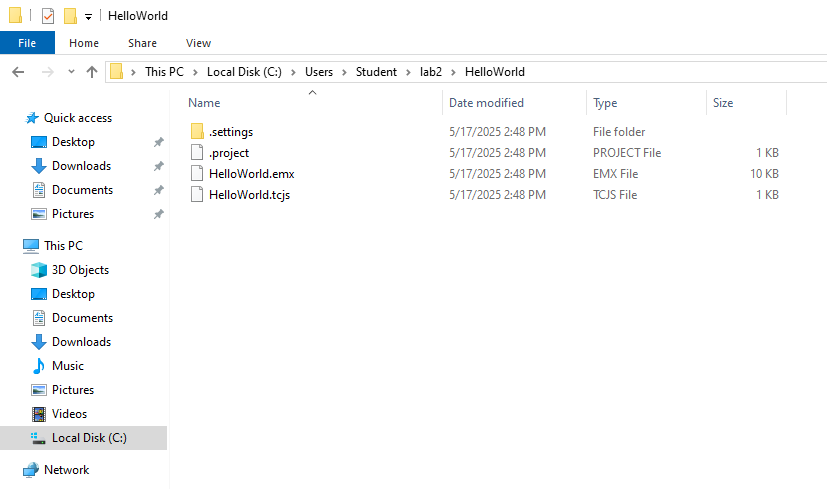

# 3. Working in Eclipse and RSARTE Workspaces

It is assumed that no overview of basic Eclipse operations, concepts and functionality is not required for this class because students are experienced Eclipse users.

There is not a lot of theory to cover in this module since it will be mostly interactive.

---

## The RSARTE Perspective

A Realtime project is composed of two separate projects

1. Modeling project
2. The C++ project generated from the modeling project

The RSARTE perspective utilizes two explorers

The first is the standard project explorer that shows the main files and directories as we would expect.

For example, in the "HelloWorld" project in lab 2, the file structure is:

The modeling project is encapsulated in the `HelloWorld.emx` file.

The `HelloWorld.tcjs` contains the instruction for generating C++ code.

The relationship between the explore functions can be visualized this way:

### The Model Perspective

In the IDE, the project looks like this:

Note that the contents of the `.emx` file are displayed in the project explorer window because the model explorer has expanded the contents of the model file so that we can see the individual components.         

### The Model File

The model file is an XML file. For example, the model file generated in lab 2 looks like this"

---

## RSARTE-Specific Views

- Use Outline View for quick access to structural elements in diagrams.
- Contextual tabs and views change based on the selection—state, port, operation, etc.