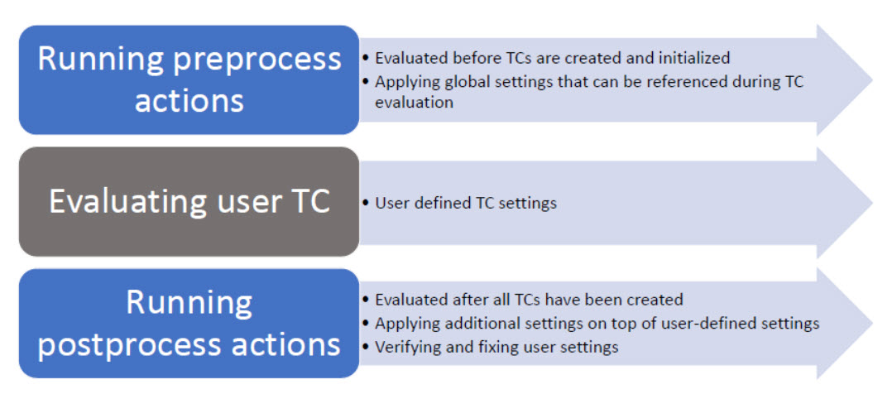

# 4. Building and Generating Code

## Build Process

The translation of a UML model into an executable real-time application goes through the following steps:
1. A subset of the model is transformed to C++ code.
2. Eclipse CDT project and a makefile are generated.
3. A make tool is launched to build the generated code using the makefile.
4. Messages (such as compilation errors) that are produced during the build are captured and printed.

### Build Modes

There are two ways of building a model.

**Interactive**: Executed from RSARTE user interface

**Batch**: Executed from the command line or invoked from a script scripts. In both cases 

Both modes perform exactly the same set of steps described earlier

The difference between build modes are:
- How the build is triggered
- What happens after the build is done. For example:
  - In an interactive build, most build messages are printed to the UML Development Console
  - In a batch, build messages are typically printed to the command line console or written to a log file.

### Model Compiler

The RSARTE utility which builds a model is called the model compiler. 
- Stand-alone command line tool mode
  - Can be run as a separate application independent of the RSARTE IDE. 
  - Can be used for true batch builds without using IDE. 
- Interactive build mode from within the IDE. 
  - RSaRTE will launch the model compiler for generating the code and a make file
  - The generated code is then built by make.

#### Parallel Builds

If the C++ build system supports parallel execution of make rules
- It is possible to generate a single make file from RSARTE that contains rules that invoke the model compiler for the code generation. 
- The entire build can be driven by a single make file. 
- This could boost build performance by parallelizing the generation of C++ files
- But the model compiler will be invoked multiple times, which involves some overhead. 
- To see if this is an advantage, performance measurement on the build platform is necessary
- Parallel builds are only available for batch builds.

---

## Transformation Configurations

The transformation of a model to compiled code can be done in many ways depending on the build configuration properties like the following.
- The subset of the model to be built
- How should the generated C++ code be compiled
- Which target configuration of the RT services library should be used


# Code Generation Overview

RSARTE generates executable platform-specific C++ code from a platform-independent UML-RT model.

The code generation process includes:
- State machine logic for capsules.
- Port and protocol definitions.
- Inter-capsule communication.
- Top-level configuration (main function and RTS initialization).

## State Machine Logic for Capsules

- Capsules encapsulate behavior using hierarchical state machines.
- The generated code must preserve deterministic execution and message-driven semantics.

Code Generation Behavior:
- Each capsule gets a C++ class, where:
  - States become methods or enum values.
  - Transitions become switch or dispatch logic.
  - Entry/exit actions are translated into function bodies.
- State logic is typically placed in methods like `handleEvent()` or `inject()`.

## Port and Protocol Definitions

- UML-RT uses typed ports to enforce contract-based communication between capsules.
- Each port is typed with a protocol (a set of incoming/outgoing messages).

Code Generation Behavior:
- Ports become class attributes (RTSystemPort, RTConjugatePort).
- Each protocol generates:
  - Message identifiers (e.g., signalId_X)
  - Dispatcher stubs to call appropriate handlers
  - Header files defining messages, roles, and direction

## Inter-Capsule Communication

Capsules are loosely coupled, communicating only via ports.
- Ensures safe message-passing and isolation between components.

Messages are queued and dispatched by the RTS (run-time system).

The code generator creates:
- Message class instances
- Queue management logic (e.g., send(), receive() methods)
- Connectors for wiring capsules (defined in the model's composite structure)


---

## Code Transformations

The Transformation Configuration (TC) file defines how the UML-RT model is converted into executable C++ (or C) source code. 
- Acts as a bridge between the logical model and the generated code, specifying what should be generated, how it should be organized, and what additional artifacts or settings apply.

A TC is a model element (usually named RTComponent) stored in a .etx file. It provides instructions for:
- Code generation targets and settings
- Output folder structure
- Inclusion and linking of external libraries
- Mapping between model elements and generated artifacts

### Key Elements and Properties of a Transformation Configuration

Name and Type
- The TC typically has a name like RTComponent and is applied at the project level.
- Language-specific (e.g., C++, C).

Target Directory
- Defines where generated source and header files are placed.
- Example: MyModel_target/src/ and include/.

Model Elements to Generate
- Can be set to generate:
  - Entire model (.emx file)
  - Specific packages or capsules
    - Fragmented models use .epx files and the TC manages how these are aggregated during generation.

Include Paths and External Code
- Specify additional header search paths.
- Define dependencies on external libraries or artifacts.
- Example: include <RTServices> for runtime services.

Code Generation Options
- Flags to control:
  - Inline function generation
  - Virtual/pure virtual declarations 
  - Generation of destructor implementations
  - Naming conventions (prefixes/suffixes)

Build Configuration
- Integrates with Eclipse CDT for building the generated code.
- Links model output with a C++ target project (e.g., MyModel_target).
- Ensures header and source files are recognized by the Eclipse build system.

### Location and Management
- TC files are typically saved with a .etx extension inside the modeling project.

### How It Operates

- Modeler builds the UML-RT model.
- Transformation is triggered manually or by build actions.
- The Transformation Configuration reads:
  - Which parts of the model to include
  - Where to output code
  - How to structure classes, functions, and files
- RSARTE generates .cpp and .h files accordingly.
- The output project is built using Eclipse CDT or external build tools.

### Best Practices

- Maintain one TC file per model project unless generating multiple variants.
- Use fragmented models for large systems and include them in the TC via .epx references.
- Always verify output directories to prevent overwriting or misplaced code.
- Keep TC files under version control—they define how your models are turned into software.

### Documentation Review

[TC Deep Dive](https://www.ibm.com/docs/en/dmrt/12.1.0?topic=SS5JSH_12.1/Articles/Building/Building%20CPP%20Applications/Applying%20Transformation%20Configurations/Configuring%20Transformation%20Configuration%20Properties.htm)

---

## Managing Build Variants

RSARTE allows TC files to be defined and extended using JavaScript, offering dynamic and programmable control over transformation logic.

[Build Variant](https://model-realtime.hcldoc.com/help/index.jsp?topic=%2Fcom.ibm.xtools.rsarte.webdoc%2FArticles%2FBuilding%2FBuilding+CPP+Applications%2FManaging+Build+Variants.html)

Application Variants
- Create a debug versus a release build of the application.
- Add special instrumentation to the application in order to detect run-time errors.
- Build the application for different target platforms.

Defining a new build variant may require a large number of TCs to either be created or updated. 
- Can result in a huge number of TCs to choose from when deciding what to build.

The model compiler solution
- One set of TCs that are common for all variants of an application that need to be built. 
- SStore properties that are common for all build variants in the TC
- Dynamically add or modify the TC properties that are specific for a particular build variant. 

Done by writing one or many scripts (using JavaScript) that are run by the model compiler. 
- Can be run either just before ("pre-processing") or run just after ("post-processing") the default interpretation of TC properties. 

Example:
- A pre-processing script you assign values to variables that are referenced in TC properties
- A post-processing script can directly modify the properties in the built TC or its prerequisites. 

All modifications performed by the scripts are transient, which means that they will never be stored in a TC file, but will only be used in the current build.



The model compiler provides a Transformation Configuration Framework (TCF)
- JavaScript API for working with TCs. 
- Provides functions for reading and writing TC properties, traversing prerequisite TCs, working with TC inheritance, and much more. 

Another JavaScript API is the Build Variant Framework (BVF)
- Allows defining which build variants to make available for users when they build a TC (either from the user interface or command-line). 
- The build expert writes the scripts that implement the different build variants
  - And also defines the user interface with the controls other users will see when they build a TC. 
- Each value set for those controls in the user interface maps to the execution of one or two scripts at build-time (pre-process script, post-process script or both).

### Syntax and Variables

JavaScript-based TC files use Rhino-based JavaScript (ECMAScript) interpreted at transformation time.

A JavaScript TC file exports a configuration object, typically as follows:

```javascript
var configuration = {
name: "MyCustomRTComponent",
model: "MyModel.emx",
output: "src-gen",
options: {
generateDestructors: true,
enableTracing: false
}
};
```

Key Variables:
```javascript
configuration.name – Identifier of the transformation
configuration.model – Path to the root .emx file
configuration.output – Directory where code is generated
configuration.options – Dictionary of custom flags used by transform logic
```

For example:

```javascript
configuration.target = context.target; // name of build target (e.g., "Windows" or "Linux")
```

This code assigns the current build target name (such as "Windows", "Linux", or "Test") from the RSARTE transformation context into a new property called target on the configuration object.

context.target:
- This comes from the RSARTE transformation context and contains the name of the active transformation target selected by the user (e.g., a build profile like EmbeddedLinux, Test, Debug, etc.).

configuration.target:
- This is a custom property being added to the configuration object. It's not required by RSARTE, but can be used later in the script for conditions, logging, or custom logic.

#### Defining Variant Properties

Can override the default top-level capsule instantiated at startup using:

```javascript
configuration.mainCapsule = "MyTopCapsule";
```

To define different capsules per build variant
- For example: test-driven development or multi-product configurations.

```javascript
if (context.target === "Test") {
configuration.mainCapsule = "TestCapsule";
} else {
configuration.mainCapsule = "ProductionCapsule";
}
```

Per-Target Options
- JavaScript allows you to conditionally change settings depending on the target environment:

```javascript
if (context.target === "EmbeddedLinux") {
configuration.output = "embedded-src";
configuration.options.enableOptimizations = true;
} else {
configuration.output = "desktop-src";
configuration.options.enableTracing = true;
}
```
Per-target configuration is essential in multi-platform systems where tracing, optimization, or capsule selections vary by deployment.

### Customizing Code Generation with Transform Scripts

Provide fine-grained hooks into the code generation pipeline. 
- These scripts are JavaScript files that modify how elements are transformed.

Use Cases:
- Injecting logging into all operations
- Adding version headers or legal banners
- Skipping generation of deprecated classes

Location and Binding
- Transform scripts are associated with a TC via:

```javascript
configuration.transformScript = "myTransformScript.js";
```
    
The script uses a known API to hook into the transformation:

```javascript
function transformElement(element, context) {
if (element.isClass() && element.getName().startsWith("Deprecated")) {
element.setDoNotGenerate(true);
}

// Add logging to all operations
if (element.isOperation()) {
var code = element.getCode();
element.setCode("// LOG START\n" + code);
}
}
```
