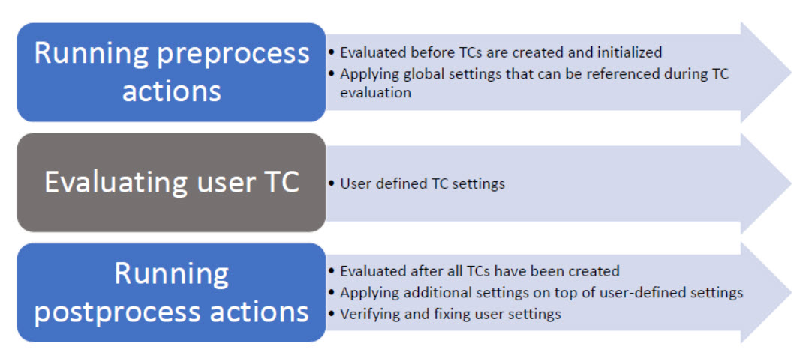

# 7 Managing Build Variants

RSARTE allows TC files to be defined and extended using JavaScript, offering dynamic and programmable control over transformation logic.

[Build Variant](https://model-realtime.hcldoc.com/help/index.jsp?topic=%2Fcom.ibm.xtools.rsarte.webdoc%2FArticles%2FBuilding%2FBuilding+CPP+Applications%2FManaging+Build+Variants.html)

Application Variants
- Create a debug versus a release build of the application.
- Add special instrumentation to the application in order to detect run-time errors.
- Build the application for different target platforms.

Defining a new build variant may require a large number of TCs to either be created or updated.
- Can result in a huge number of TCs to choose from when deciding what to build.

The model compiler solution
- One set of TCs that are common for all variants of an application that need to be built.
- SStore properties that are common for all build variants in the TC
- Dynamically add or modify the TC properties that are specific for a particular build variant.

Done by writing one or many scripts (using JavaScript) that are run by the model compiler.
- Can be run either just before ("pre-processing") or run just after ("post-processing") the default interpretation of TC properties.

Example:
- A pre-processing script you assign values to variables that are referenced in TC properties
- A post-processing script can directly modify the properties in the built TC or its prerequisites.

All modifications performed by the scripts are transient, which means that they will never be stored in a TC file, but will only be used in the current build.



The model compiler provides a Transformation Configuration Framework (TCF)
- JavaScript API for working with TCs.
- Provides functions for reading and writing TC properties, traversing prerequisite TCs, working with TC inheritance, and much more.

Another JavaScript API is the Build Variant Framework (BVF)
- Allows defining which build variants to make available for users when they build a TC (either from the user interface or command-line).
- The build expert writes the scripts that implement the different build variants
    - And also defines the user interface with the controls other users will see when they build a TC.
- Each value set for those controls in the user interface maps to the execution of one or two scripts at build-time (pre-process script, post-process script or both).

### Syntax and Variables

JavaScript-based TC files use Rhino-based JavaScript (ECMAScript) interpreted at transformation time.

A JavaScript TC file exports a configuration object, typically as follows:

```javascript
var configuration = {
name: "MyCustomRTComponent",
model: "MyModel.emx",
output: "src-gen",
options: {
generateDestructors: true,
enableTracing: false
}
};
```

Key Variables:
```javascript
configuration.name – Identifier of the transformation
configuration.model – Path to the root .emx file
configuration.output – Directory where code is generated
configuration.options – Dictionary of custom flags used by transform logic
```

For example:

```javascript
configuration.target = context.target; // name of build target (e.g., "Windows" or "Linux")
```

This code assigns the current build target name (such as "Windows", "Linux", or "Test") from the RSARTE transformation context into a new property called target on the configuration object.

context.target:
- This comes from the RSARTE transformation context and contains the name of the active transformation target selected by the user (e.g., a build profile like EmbeddedLinux, Test, Debug, etc.).

configuration.target:
- This is a custom property being added to the configuration object. It's not required by RSARTE, but can be used later in the script for conditions, logging, or custom logic.

#### Defining Variant Properties

Can override the default top-level capsule instantiated at startup using:

```javascript
configuration.mainCapsule = "MyTopCapsule";
```

To define different capsules per build variant
- For example: test-driven development or multi-product configurations.

```javascript
if (context.target === "Test") {
configuration.mainCapsule = "TestCapsule";
} else {
configuration.mainCapsule = "ProductionCapsule";
}
```

Per-Target Options
- JavaScript allows you to conditionally change settings depending on the target environment:

```javascript
if (context.target === "EmbeddedLinux") {
configuration.output = "embedded-src";
configuration.options.enableOptimizations = true;
} else {
configuration.output = "desktop-src";
configuration.options.enableTracing = true;
}
```
Per-target configuration is essential in multi-platform systems where tracing, optimization, or capsule selections vary by deployment.

### Customizing Code Generation with Transform Scripts

Provide fine-grained hooks into the code generation pipeline.
- These scripts are JavaScript files that modify how elements are transformed.

Use Cases:
- Injecting logging into all operations
- Adding version headers or legal banners
- Skipping generation of deprecated classes

Location and Binding
- Transform scripts are associated with a TC via:

```javascript
configuration.transformScript = "myTransformScript.js";
```

The script uses a known API to hook into the transformation:

```javascript
function transformElement(element, context) {
if (element.isClass() && element.getName().startsWith("Deprecated")) {
element.setDoNotGenerate(true);
}

// Add logging to all operations
if (element.isOperation()) {
var code = element.getCode();
element.setCode("// LOG START\n" + code);
}
}
```
