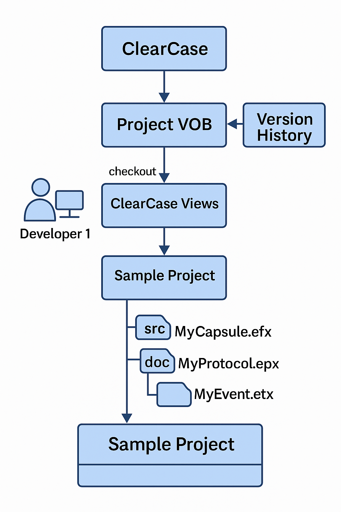

# 08 ClearCase Integration (Highlights)

This module is a high level overview on integrating RSARTE models with ClearCase version control.

## Where Models Live in the ClearCase File Structure

RSARTE models are stored in Eclipse projects, which map to directories in the ClearCase VOB (Versioned Object Base).
- Model files include .emx, .epx, and .etx files. 
- Each UML model element is serialized as an XML entry.
- Because the model is represented as an XML file, it means that the type handlers in ClearCase can perform effective versioning operations.

#### File Types

.emx (Eclipse Model XML): The primary model file for a UML-RT model package. 
- Stores elements such as classes, capsules, protocols, and diagrams. 
- Typically corresponds to a root or top-level package.

.epx (Eclipse Package XML): A supporting file for nested packages or diagrams. 
- Used to modularize large models into nested logical units. 
- Commonly used when model fragments are enabled.

.etx (Eclipse Textual XML): Stores associated textual annotations, such as C++ inline code blocks, state machine actions, or transform settings.
- Keeps source code-like content separate from the main structure for easier parsing and merging.

.efx (Eclipse Fragment XML): Represents modularized portions of a model (fragments) that are split out from larger .emx files. 
- Ideal for versioning subsystems or high-change areas independently.
- Automatically managed when you externalize a package using RSARTE.
- Enables distributed ownership and editing of logically distinct parts of the model.
- Recommended for team-based workflows where parallel development is common.

#### Project Structure
A common structure includes:
/myvob/SensorControlModel/
├── .project                      # Eclipse project descriptor
├── .settings/                   # Eclipse-specific settings
├── model/
│   ├── RootPackage.emx          # Top-level model file
│   ├── CommProtocol.efx         # Fragmented protocol package
│   ├── ControlCapsule.efx       # Fragment for capsule logic
│   ├── StateLogic.etx           # Inline code for state actions
│   └── InternalUtils.epx        # Nested package reference
├── src/                         # Generated or custom C++ source code
│   └── SensorControlApp.cpp
├── tc/
│   └── build.tc                 # Transform Configuration script
└── README.md

## Strategies for Versioning: Full Model vs Fragments

#### Full Model:

- Simple version control of the entire model project.
- Suitable for small teams or projects where model content is not heavily concurrent.
- Pros: easier to manage.
- Cons: higher merge conflict risk.
  - When the model is versioned as a monolithic unit, small changes (e.g., renaming a class or modifying a state machine) can change large XML files like .emx, increasing the chance that multiple developers inadvertently change the same file. 
  - Merges more complex because XML merges are prone to subtle corruption if structure or ordering is altered incorrectly. 
  - The lack of granularity limits the ability to assign model ownership cleanly.

#### Model Fragments:

- Breaks large models into smaller units (.efx fragments), which can be versioned independently.
- Supports parallel team development.
- Use “fragment packages” to isolate ownership per subsystem.
- Encouraged in UCM stream-based development.
- Pros: significantly reduces merge conflicts by localizing changes to modular units. 
  - Enhances traceability of changes per subsystem and allows multiple team members to work concurrently.
- Cons: introduces complexity in managing cross-fragment references and increases overhead for refactoring, as changes must be carefully coordinated across multiple fragments.

#### Creating and Using .efx Files in RSARTE:

- To modularize your RSARTE model and generate .efx files:
- In the Model Explorer, locate a package you want to externalize.
- Right-click the package → Refactor → Externalize to New Fragment.
- Choose a file name and destination folder within the model project (usually model/).
- RSARTE creates a new .efx file containing the contents of that package, and updates the original .emx file to reference the fragment.
- From this point on, edits to that package are stored in the .efx file, making it suitable for separate versioning and parallel development.

---

## Best Practices for Model Element Ownership and Lock Control

Use ClearCase checkout to lock .emx/.epx files during edits. 
- This prevents accidental concurrent changes to model artifacts, which can corrupt structural consistency.

Follow package-based ownership:
- Assign responsibility for specific packages/fragments to individuals or teams.

Avoid editing shared or root-level elements unless coordinated. 
- These are frequently accessed and can serve as integration points; uncoordinated changes here often lead to cascading merge issues.

Use RSARTE’s Team support to visualize ownership and change history.

Automate unlock or notify policies via ClearCase triggers.

#### RSARTE's Team Support Overview:

RSARTE integrates with Eclipse's Team features to provide model-aware version control interactions.

It enables users to:
- View model file ownership and version status.
- Compare revisions graphically using Model Compare.
- Synchronize local and repository versions with the Team Synchronizing perspective.

How to Access:
- In Eclipse, right-click any project or file under version control.
- Select Team to open version control options (e.g., Check In, Check Out, History).
- Open the Team Synchronizing perspective from Window → Perspective → Open Perspective → Other → Team Synchronizing.
- Use the History view (Right-click → Team → Show History) to view previous revisions.

Use Cases:
- Visualizing who owns or last changed a .emx or .efx file. 
- Reviewing history before merging.
- Reverting or resolving conflicts without affecting model integrity.

---

## Impact of ClearCase Merges on Model Structure

- XML-based models are sensitive to whitespace, attribute order, and element placement.
- Avoid parallel edits to the same .emx file unless necessary. 
- Use RSARTE’s built-in Model Compare and Model Merge tools rather than raw file merges.
- Keep fragments small and atomic to reduce merge complexity.
- Always validate models after a merge using the RSARTE Model Validator.

---

## RSARTE Compatibility with UCM and Dynamic Views

UCM (Unified Change Management):
- Fully supported.
- Best suited for stream-based development with clear ownership.
- Baseline creation ties into RSARTE project states.

Dynamic Views:
- Supported, but can be slower with large models.
- Useful for real-time sharing, but introduces risk of uncoordinated edits.
- Snapshot views are preferred for build reproducibility and CI environments.