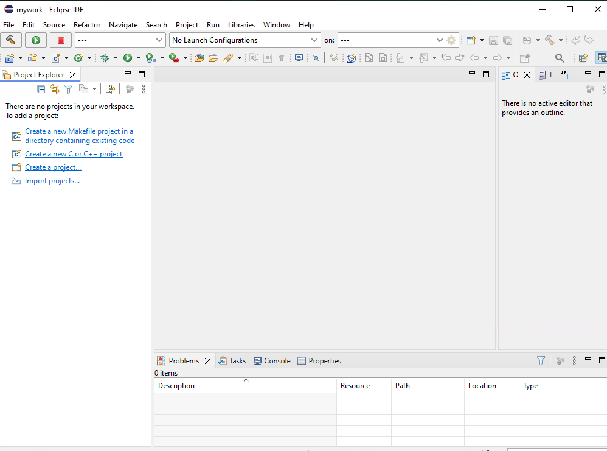

# Lab 01: Setup

This is a very brief lab to guide you thorough the process of accessing the VM you will be using and starting up configured environment.

The VM will be available 

---

## Step 1:

- You should have received an email or other communication from LearQuest with the login credentials for your VM
- Login and look for an option with the name "Computer Assignment" or some similar title. 
- Select it and there should be a drop-down list that looks something like this.

- Select the machine name, in the screenshot this is "PSFB-RSARTE-100"

This will open up a desktop that looks something like this
- You will see only your machine.
- The screenshot is of the instructor's desktop that may differ a bit from what you see.

- Start the VM by either clicking on it or using the blue "run" button.
- If you just clicked on the machine, you should see something like this:

- Click on the machine to start
- Wait for the machine to load and run
- This may take a while.

- Once the desktop loads, login as user "Student" 
- The password can be found by selectin the keyring icon at top.
- Selecting the square icon on the right of the password copies it directly into the Windows password field.

- This part is complete when you see the Window's desktop.

----

## Starting RSARTE

In order for RSARTE to work correctly, the environment for build tools needs to be configured.
- For the VM, this is done by starting RSARTE with a startup script to streamline the process
- To avoid any configuration issues, the C++ tool set installed is the recommended MSVC 2018 build tools

- The product is installed in the directory `C:\IBM` as shown below

- Open a command prompt and locate to the `C:\IBM` directory. 
- Execute the `startup.bat` command.
- This set up the build environment and start Eclipse
- Don't close this window, just minimize it. 
- In the screenshot, the `lq` build tool is executed just to demonstrate the environment is set up.

### Eclipse workspace

The first time you start up Eclipse, the workspace will default to `test1`
- This was the workspace originally used to test the product installation.
- Choose your own workspace instead so you start with a clean environment.

You should see the C++ perspective open when Eclipse starts like this

In the next lab, we will open the RSARTE perspective and explore that workspace.

The VM will sleep after a while and need to be restarted; however, the VM will only be suspended, but you will not lose any work when it sleeps.

---

## End Lab