# Lab 02: Hello World

The purpose of this lab is to work through a simple Hello World project to become familiar with the basic RSARTE IDE interface and project structure.

## Step 1: Open the Modeling perspective

If you still have IDE open from the last lab, you can continue from where you left off.

If you have closed the IDE, then follow the steps from the first lab to start the IDE using the `startup.bat` command.

This should be your starting point for this lab

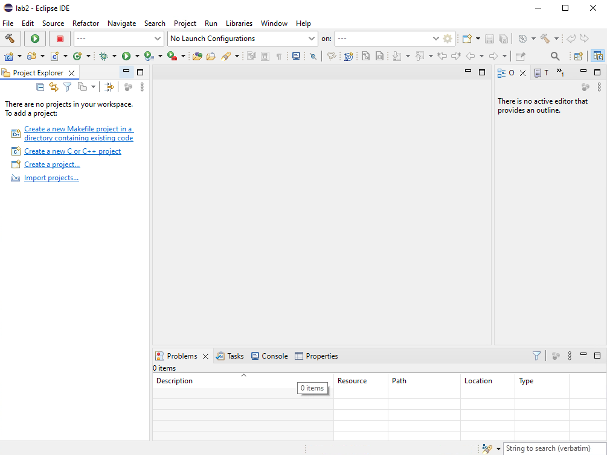

From the `Window` menu, select the other option for Perspective

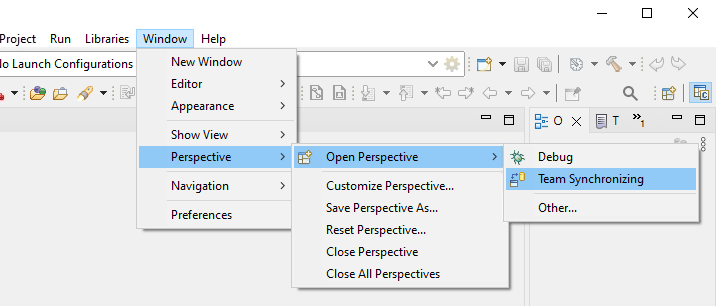

Select the `UML Modeling` pIterspective
it
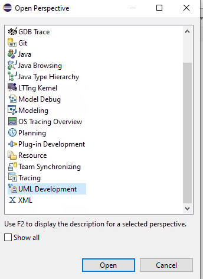

Your IDE should look like this:

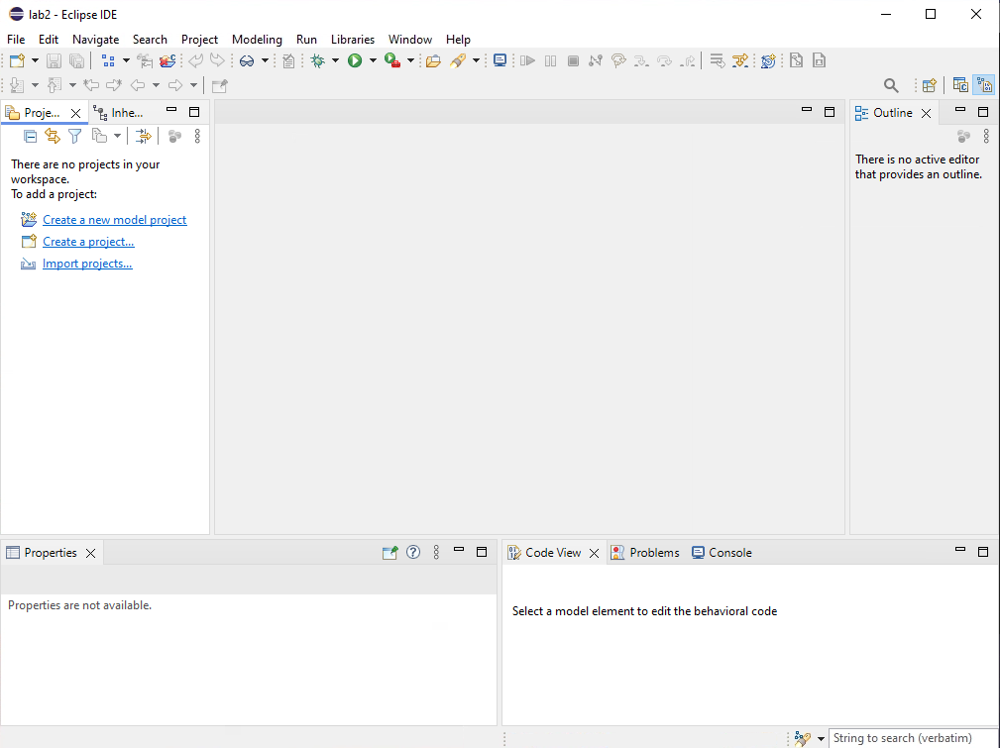

---

## Step 2: Create the HelloWorld project

Use the `Create a new Model Project` option to create a new project and give it the name "HelloWold" as shown below:

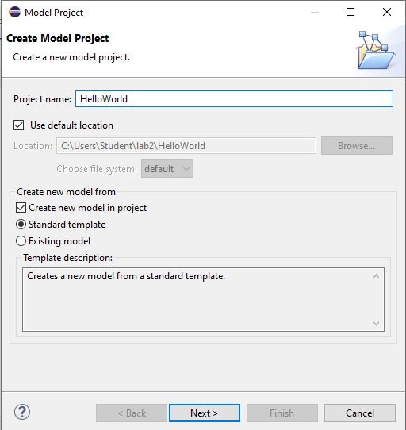

Select `Next`

In the next dialogue, ensure the `Hello World C++ Template` is selected and you have specified the file name if it isn't automatically filled in.

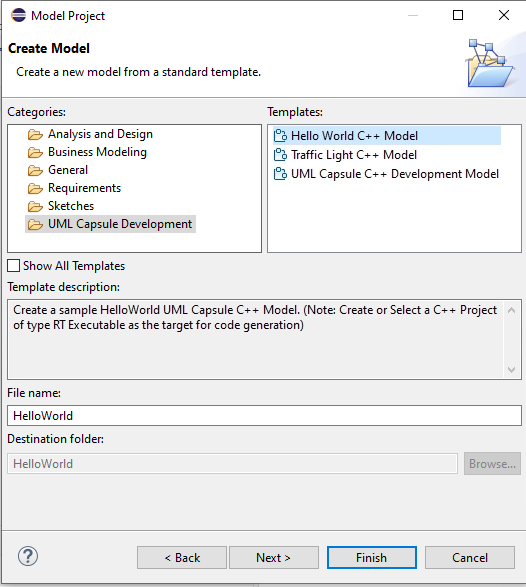

Select `Finish` and you should see something like this:

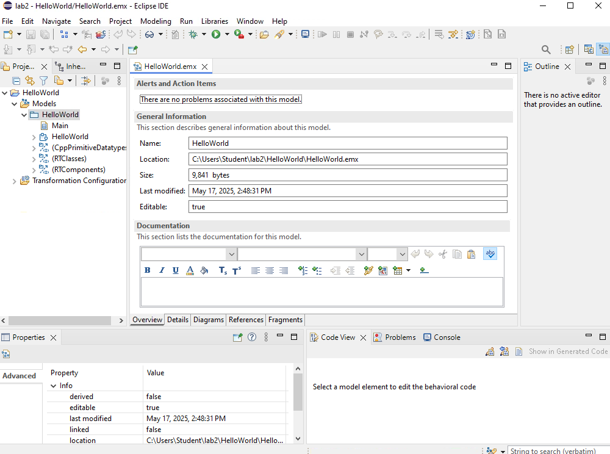

What you are seeing is the project file which has the extension  `.emx`

### Exploring the project file

- Expand the window with the metadata about the project, the window showing the `.emx` file
- At the bottom are a series of tabs that show what is packaged up in this model file
- Select the different tabs and explore what they show.

---

## Step 3: Build and Run the Project

First, we have to set up the transformation parameters

### Open the editor

Right-click on the Transformation Configure file select `Open With` and then `Transformation Configuration Editor`

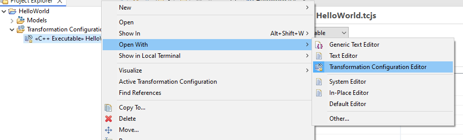

You will wind up seeing a tabbed setting box like this (note, the tabs are at the bottom)

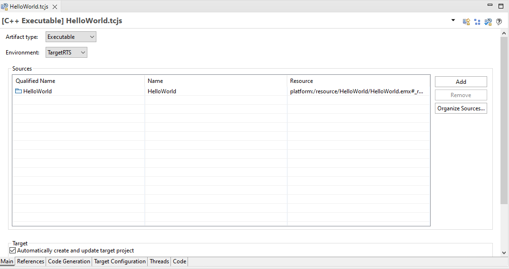

We will explore all the tabs later, but for now, we need to set the settings to use the MSCV tookchain.

### Configure the Build

Under the target configuration tab, change the settings to look like this. This ensures the MSVC version of the RunTimeServices library is being used

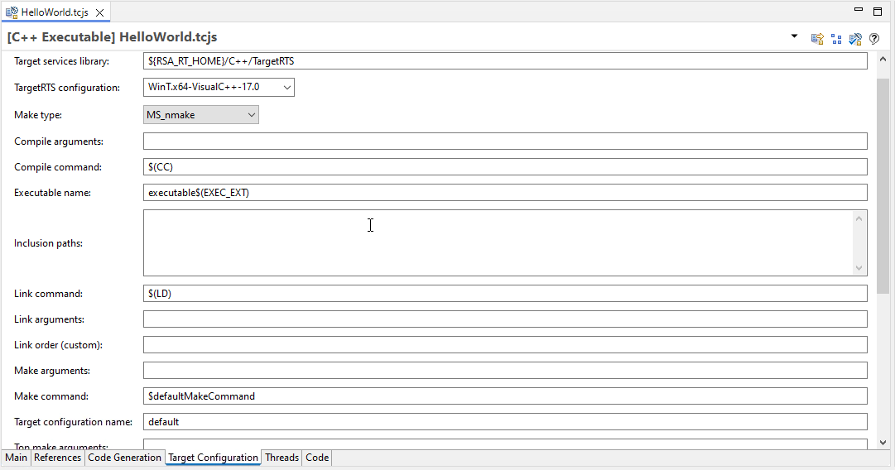

### Build

Right-click on the TC file like before, but this time, select `Build`

Review the console output

You should now see a C++ build project like this.

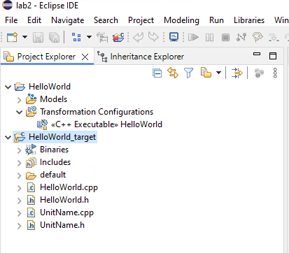

### Run the Project

On the generated binary, right-click and select `Run As -> Local C/C++ Application`

In the console you should see this

```console
RT C++ Target Run Time System - Release 8.0.10

targetRTS: observability listening not enabled


RTS debug: ->

```

Since we build a debug version, the debugger has started. Just enter 'quit' and the application will execute

```console
RT C++ Target Run Time System - Release 8.0.10

targetRTS: observability listening not enabled


RTS debug: ->quit
  Task 0 detached
Hello World from C++ Capsule

```

---

### End Lab