# Lab 03: Model Build

In this lab, you will build a simple model using the model design tools.
- The objective of the lab is to build familiarity with the modeling interface

---

## Overview

The application consists of two capsules

1. Main capsule which sends a "Hello World" message to the
2. Receiver capsule, which logs the message using logPort.


## Step 1: Create the project

In the IDE, create a new model project called `Lab3`. Note that in the screenshots, this is being created in an Eclipse workspace called `lab3` - your workspace name is probably different, which is fine.

Us the default project settings as shown:


Select `Next`

Use the `UML Capsule C++ Development` template and give it the name `HelloWorld` as shown


Select `Finish`

Review the details of the `.emx` file and close the editor windows.

You should see something like this on the screen. Note the palette on the right-hand side of the editor space.

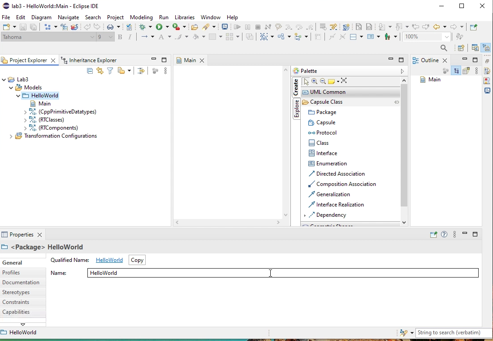

## Step 2: Create a Protocol

From the palette, drag the `protocol` icon onto the canvas and give it the name `HelloProtocol` as shown below. Note the entry also appears in the model explorer.

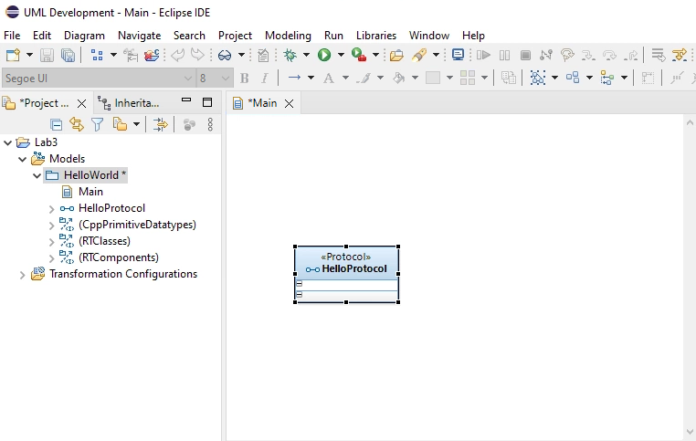

Because we are going to view our receiver capsule as the one that does the actual work, we will define the protocol from the receiver perspective. This is an arbitrary decision.

- Double-click the protocol class on the canvas and look at the properties tab at the bottom of the work area
- Select the `InEvents` tab
- Use the top icon on the right (mouse over to see it named `Insert New in Event`) to add a new event
- Rename the event to `sayHello` And give it the data type of `RTString` as shown below.
- We need to do this since the normal String class is not recognized.


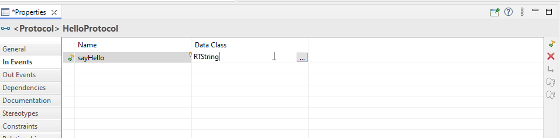

Confirm that this is displayed in the model explorer like this by opening up the properties tab for the inEvent sayHello


Now we have to create the parameter

In the Inevent properties, select `Parameters` and change the name to `message`

It should look like this in the explorer

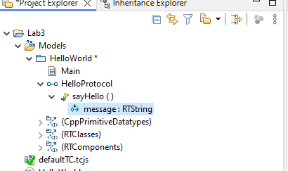

## Step 3: Create the Receiver capsule

From the palette, drag the capsule icon to the canvas and name it `Receiver`


 ### Add the log port.

The Receiver will print the message on a log port. 

- Right-click on the Receiver in the explorer and select `Add UML -> poet'

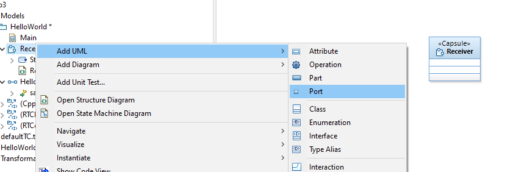

A dialog box will ask you if you want to use an existing element.
- Select that option
- In the search box, look for log


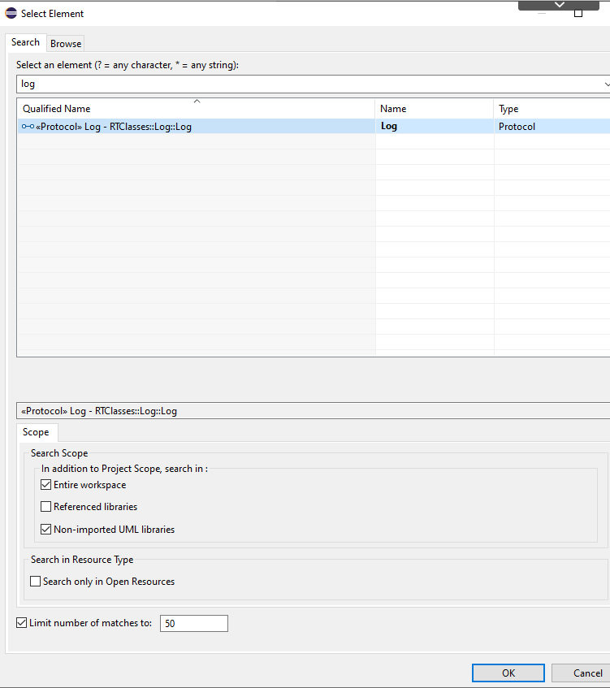


Right mouse click in the diagram on the port icon and open the properties dialog
- Since you chose the log port, the protocol is already specified.
- Change the name to `logPort`


Select it and then open the properties of the log port and rename it to `logPort`
 

### Add a Receiver port

Right-click on the Receiver and select `Add UML -> Port`
- Just like the log port, a dialog box will open asking if you want to use an existing element or create a new protocol. 
- Since you already have created the protocol, select the use existing option.
- In the search box that comes up, enter `HelloProtocol` and select the result.
- In the property box for the port, change the name to `rcvPort`


Save everything and switch over to the main tab.

You should see something like this:

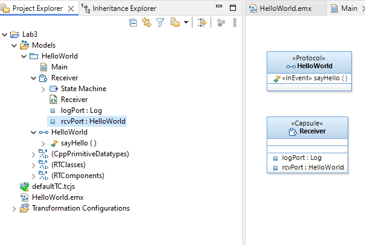


### Add the internal logic

From the model explorer, look for the state machine item under the receiver capsule and double-click to open a statechart.
- Note that this is shown in a new tab alongside the main canvas tab

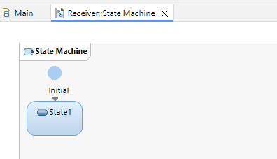

Now change the name of the state to `Waiting`

Using the palette tools, draw a transition from the state back to the state.
- THis is a self-transition
- The state represents waiting for a message.
- Once it is received, the transition will execute an action
- But then we return to a waiting state for the next message
- Using the properties, rename the transition from t1 to `proc`

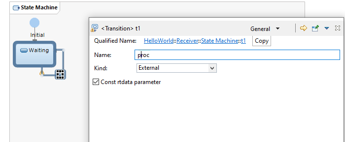

#### Validation

If you right-click on the main model in the model explorer, and select `Validate`, you will get a warning that there is no trigger for this transition.


#### Add trigger

Open the properties tab for the transition and select the `Triggers` tab.
- The top icon on the right side is the `Add new trigger' option.
- Select it

  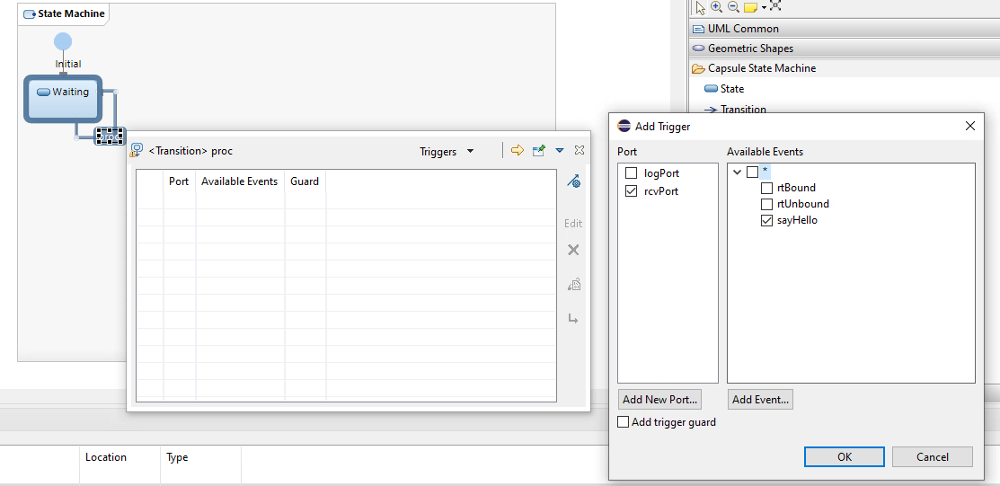

The first dialog box that comes up will ask which port the trigger will come from.
- Since there is only one port, `rcvPort`, choose that and select `Next`
- When you select it, a list of messages is listed.
- Chose the one you created.

Confirm that this is now in the properties tab.

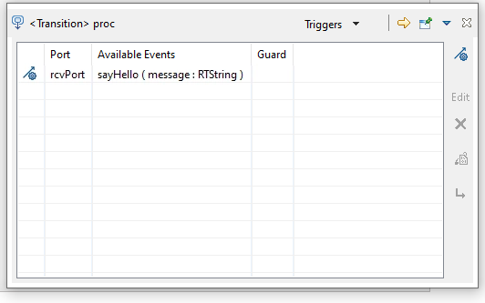

#### Add Action Code

To do this, you need to open the code view
- In the canvas, select the transition
- Right click and select  `Show View -> Code View1


In the `Effect` tab, enter the action code. 

```text
logPort.log("Received Message: " + message);
```

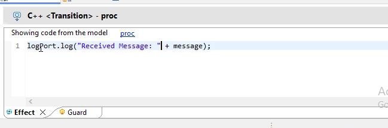

## Step 3: Create a Sender Capsule

Using the pallet, create a Sender Capsule the same way you did the Receiver

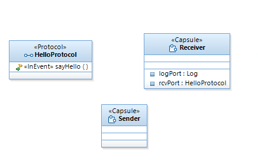


### Create The Structure

We now need some way to structure the relationship between the two capsules

Select the Sender capsule and right-click on it to open the structure diagram

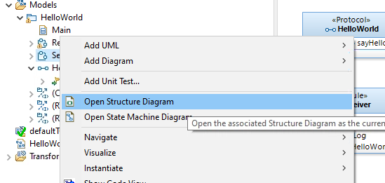

Now we add a Capsule Part by dragging it from the palette.

As we add it to the diagram, a dialog box will appear asking is we want to add an existing element or create a new Capsule.  

Select the existing component option and use the search dialog to add a Receiver capsule

The results should look like this

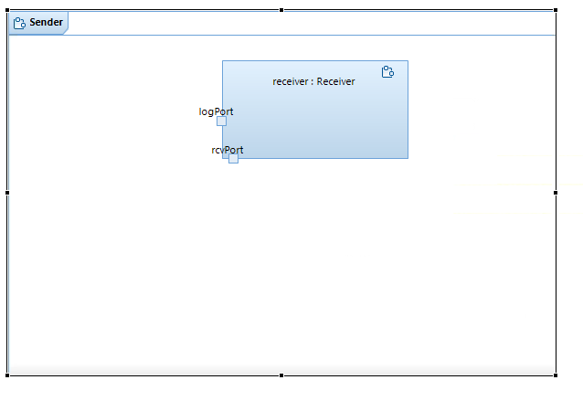

### Add the Send port

In the same diagram, drag a port into the structure diagram just like you did for the Receiver capsul part

Just like the previous step, select the existing component option, search and select the HelloWorld protocol.

In the properties tab for the port, rename it to `sndPort` and select the `Conjugated` option

Your structure diagram should look like this

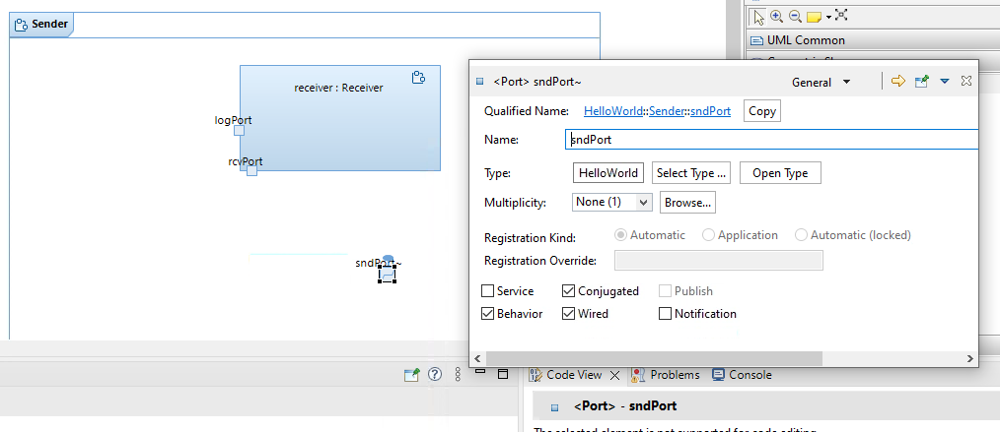

### Connect the Capsules

Select the connector tool and draw a connector from the sndPort to the rcvPort

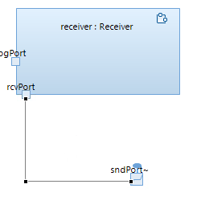


### Add Sender Logic

In the model explorer, double-click on the state machine from the Sender capsule

The logic is simple; once the Sender starts up, it sends a `sayHello(message)` to the Receiver.
- To do this, we just add an effect to the initial transition.

- Select the initial transition
- Open the code view like you did for the Receiver
- Add the line action code to the effect tab

```text
 sndPort.sayHello("Hello World!").send();
```


## Step 4: Validate the model

Your model should look like this

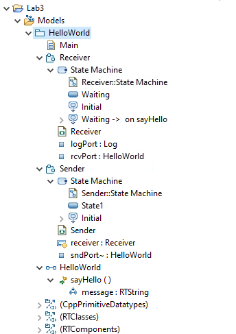

- Make sure save all your work with ctl-S
- On the top level package, right mouse click and select `Validate` 
- Your model should validate with no error and no warnings


## Step 5: Code Preview

To get a preview of the generated code, right-click on the HelloWorld model and select the code preview option

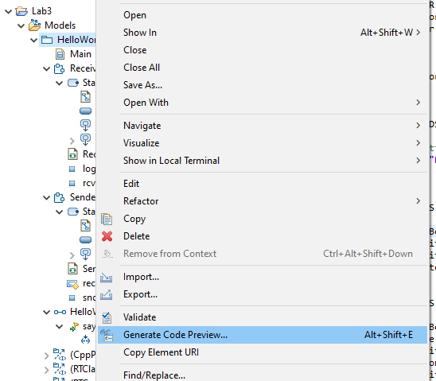

The code will be put into a `Code Preview` folder

Examine the generated files to see how the code was genereated

## Step 6: Build the project

- Spoiler Alert: The build will fail

Right click on the TC file and open it in the Transformation Configuration editor.

In the`Target Configuration` tab, select the tool chains

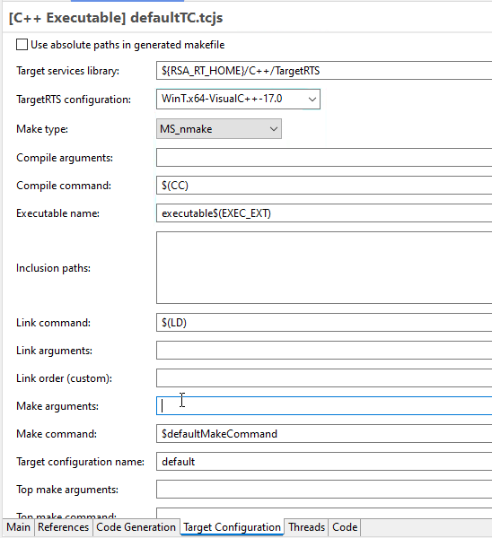

Save the configuration

Now right-click on the TC file and select `Build`

The transformation will fail because unlike Lab 2, the code generator cannot figure out which capsule is the entry point.

```console
11:20:38 : INFO : Processing transformation configuration: C:\Users\Student\lab3\Lab3\defaultTC.tcjs
11:20:39 : ERROR : Top capsule must be specified for this transformation (set property "Code Generation" -> "Top capsule")
11:20:39 : INFO : Validating source dependencies...
11:20:41 : INFO : Validating source dependencies... Done
11:20:41 : INFO : Validating transformation configurations...
11:20:41 : INFO : Validating transformation configurations... Done
11:20:41 : INFO : Validating generated source files...
11:20:41 : INFO : Validating generated source files... Done
11:20:41 : INFO : Validation completed with (1) errors and (0) warnings
11:20:41 : ERROR : Skipping code generation because of errors
11:20:41 : ERROR : Transformation completed with 2 error(s)
11:20:41 : ERROR : Skipping build step because of transformation errors
11:20:41 : INFO : Model Compiler completed with 4 error(s) and 0 warning(s)
```

We will fix this error in a later lab

---

### End Lab