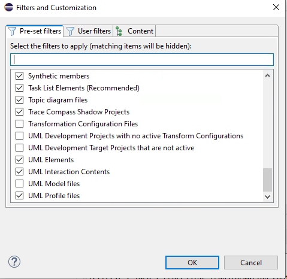
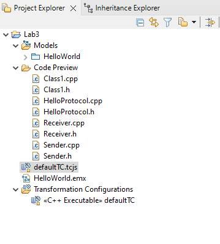
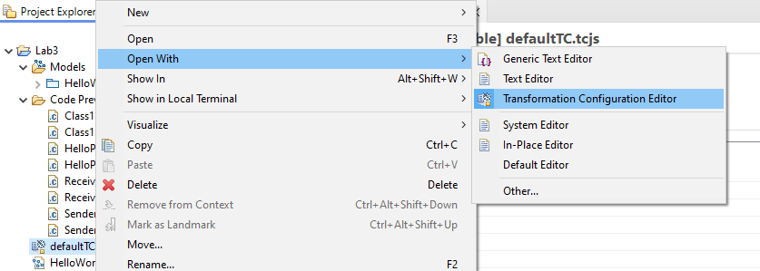
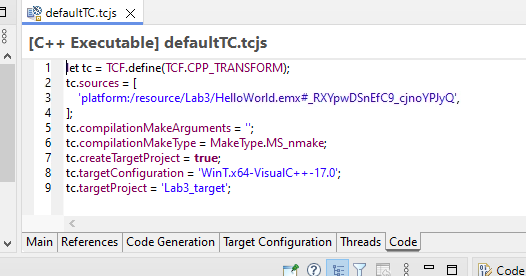
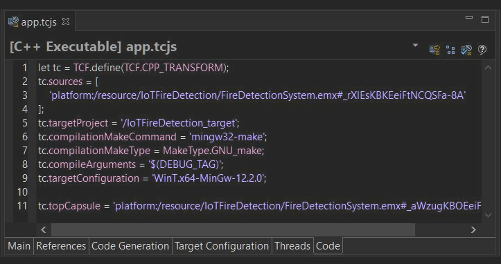
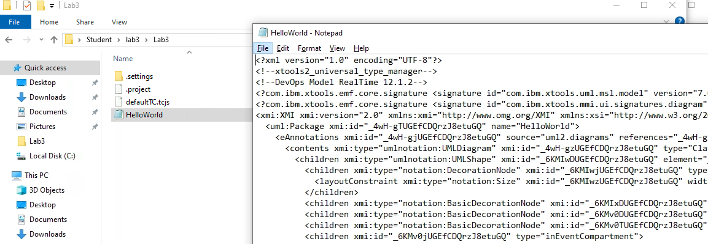
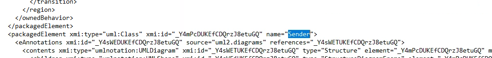

# Lab 04: Transformations

In this lab, we are going to fix the build issue we encountered in Lab 03

## Setup

- Open the project from Lab 3 in RSARTE
- At this point, you can't see the actual JavaScript files that define the transformation.
- To fix that, select the filter funnel on top of the explorer and go to the `Preset Filters` tab and scroll down until you see the `Transformation Configuration Files` option and uncheck the box



- Select OK and refresh the display if necessary.
- You should see the file now in the explorer.
- If it still marked as an error, right-click on the file and select `clean`
  


## Examine the default TC file

- Select the `defaultTC.tcjs` file
- Right-click and select `Open With -> Transformation Configuration Editor`



Once the editor opens, select the code tab to see the JS code.



## The Problem

There is no top capsule defined, like in this example from the documentation



## Step One - Get the ID of the Sender Capsule

Go into Windows file explore and open the "HelloWorld" file to see it in Notepad



Search for the name `Sender`



Note the id of the element, in this case it is '_Y4mPcDUKEfCDQrzJ8etuGQ'

**Yours will be different!!**

Now we can add the line (make sure you substitute your ID)

```text
tc.topCapsule = 'platform:/resource/Lab3/HelloWorld.emx#_Y4mPcDUKEfCDQrzJ8etuGQ';
```

Save the file and run build again.

This time the code is generated but there is a compile error.

```console
Copyright (C) Microsoft Corporation.  All rights reserved.
Building in folder .
Microsoft (R) Program Maintenance Utility Version 14.29.30159.0
Copyright (C) Microsoft Corporation.  All rights reserved.
Compiling Lab3_target:HelloWorld
	cl /c  /FoHelloWorld.OBJ  /nologo /EHsc /GF /MD /TP    /I"C:/IBM/rsa_rt/C++/TargetRTS/libset/x64-VisualC++-17.0"  /I"C:/IBM/rsa_rt/C++/TargetRTS/target/WinT"  /I"C:/IBM/rsa_rt/C++/TargetRTS/include"  /I.. ..\HelloWorld.cpp 
HelloWorld.cpp
Compiling Lab3_target:Receiver
	cl /c  /FoReceiver.OBJ  /nologo /EHsc /GF /MD /TP    /I"C:/IBM/rsa_rt/C++/TargetRTS/libset/x64-VisualC++-17.0"  /I"C:/IBM/rsa_rt/C++/TargetRTS/target/WinT"  /I"C:/IBM/rsa_rt/C++/TargetRTS/include"  /I.. ..\Receiver.cpp 
Receiver.cpp
..\Receiver.cpp(27): error C2065: 'message': undeclared identifier
NMAKE : fatal error U1077: '"C:\Program Files (x86)\Microsoft Visual Studio\2019\BuildTools\VC\Tools\MSVC\14.29.30133\bin\HostX64\x64\cl.EXE"' : return code '0x2'
Stop.
NMAKE : fatal error U1077: 'C:\IBM\plugins\com.ibm.xtools.umldt.rt.core.tools_1.50.0.v20250318_0415\tools\win32\rtperl.exe' : return code '0x2'
Stop.
17:37:55 : ERROR : Compilation failed
17:37:55 : INFO : Model Compiler completed with 1 error(s) and 0 warning(s)
17:37:55 : INFO : Done. Elapsed time 23.583 s
17:37:57 : Starting post-processing operations
17:37:57 : Compilation of 'Lab3_target' project finished with 3 errors
17:37:57 : There were errors during code generation and/or make
17:37:57 : Done. Post-processing is completed
```

Note that there are errors in the CPP files.

We will fix these in a future lab.

---

## End Lab
