# Lab 06: Build Variants

- In this lab, you will use the same model to generate two different builds.
- This will be done by creating two different *.tcjs files.

#### The Model

- The model will have two capsules, `Alpha` and `Beta`
- The only functionality will be to printo out their names when they start up.

## Step 1: Set up

Create a new modeling project called `Lab6` with the Model name ` Component`

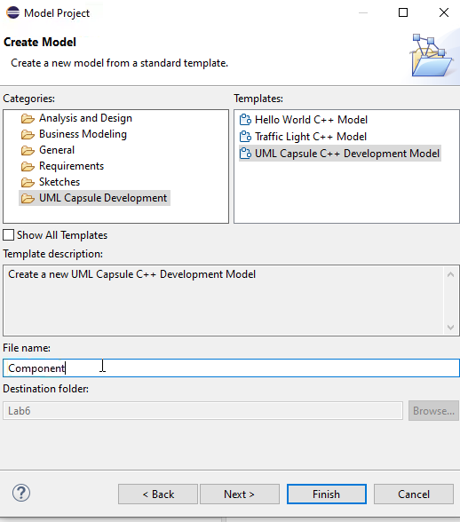

Once the project has been created, make sure that you can see the files we need to reference. In the project explorer, select the funnel and uncheck the boxes for `Configuraton Transformation Files` and `UML Model files` as shown below:

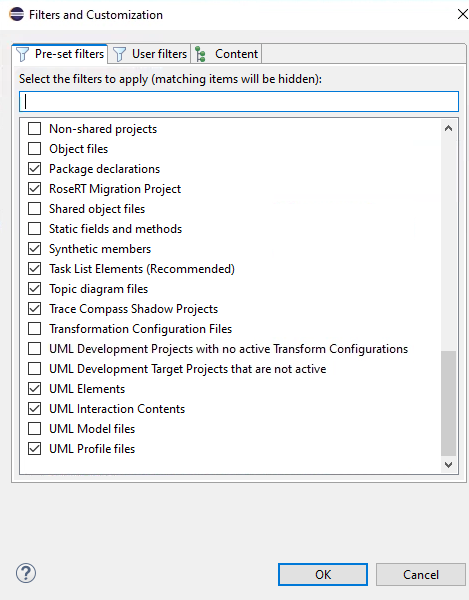

You should see the following:

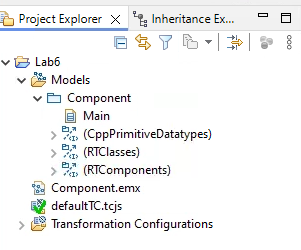

## Step Two: Create the Capsules

#### Create the Capsules

Just like you did in lab 3, create two capsules and name them `Alpha` and `Beta`

You should wind up with something like this:

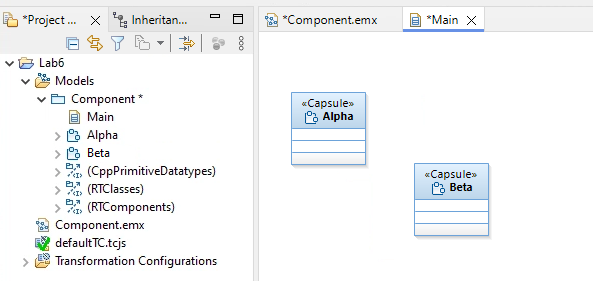

#### Add Log Ports

Just like you did in Lab three, right-click on each capsule in the explorer and select the `Add UML` option to add a port.

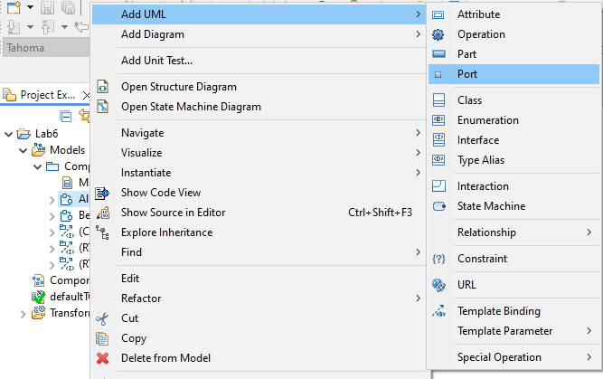

When you add the port, select the `Existing Existing Element` and search for `log` to find the Log Protocol.

You should see this after you are done.

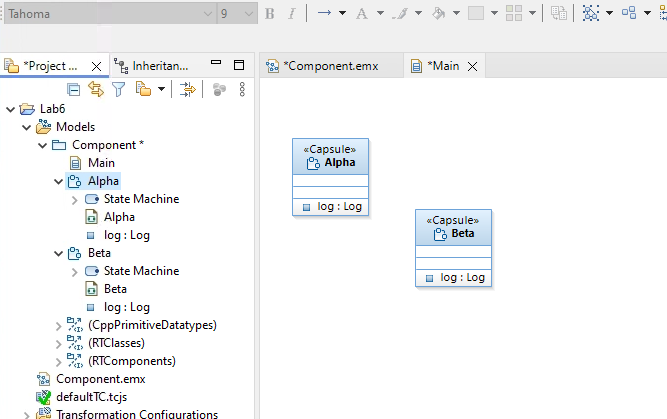

#### Add the output message

- Double-click on the Alpha State Machine and select the `initial transition`
- If you don't see the `Code View` window, right-click on the selected transition and select ` Shoe Code View`
- In the code window, enter the following action code.

```text
log.log("I am Alpha");
```

Below is a shot of what your this step should look like.

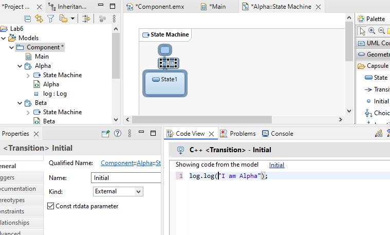

Save your work.

Do exactly the same fo `Beta` but change the message to:

```text
log.log("I am Beta");
```

This is the final model.

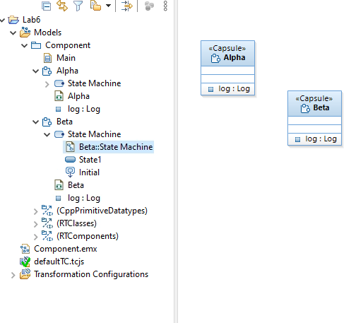

---

## Part 2: Get the capsule IDs

In the Windows file explorer, go to the directory that holds the Component.emx file.

**Be sure your model is saved before doing this**


Open your project directory in the Windows file explorer

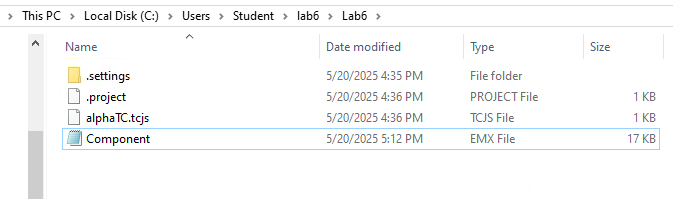

Open a text file to record the ids.

Now open the `Component.emx` file with Notepad

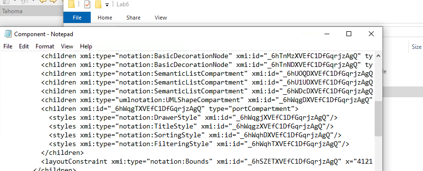

Search the file for the string "Alpha"

When you find it, copy id code which is highlighted in the screenshot.
- Remember, your codes will not be the same as what you see here.

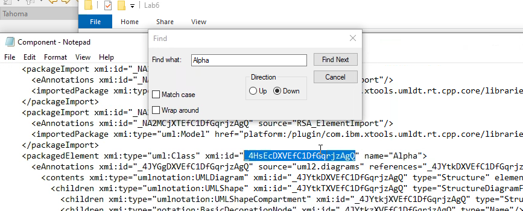

Record it in your text file

Do the same for "Beta"

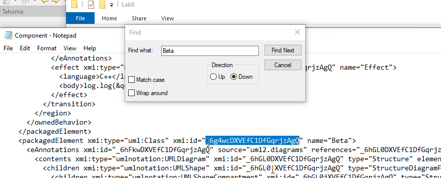

Your text file should look like this.

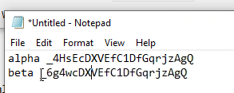


## Part 3: Set up the `Alpha` transformation.

Rename the `defaultTC.tcjs` file to `alphaTC.tcjs`.

We need to set up the build target to keep this build separate from the beta build.
- If we don't, then the two different builds will try and target the executable file, and the workspace will start getting configuration errors.
- This will manifest in the IDE by telling you that it can't clean a build

Open this file by right-clicking on it and choosing `Transformation Configuration Editor`

In the `main` tab, set the target directory

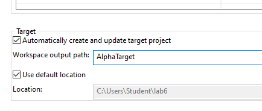

In the `target configuration` tab, set the tool chain

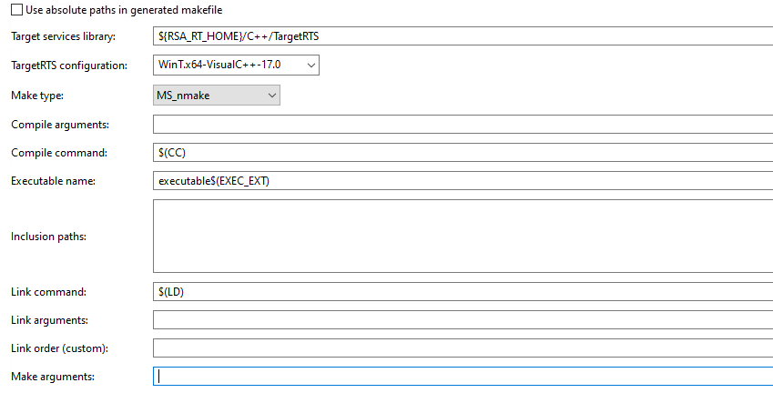

#### Top Capsule

Because we have more than one capsule, we have to specify one as the top capsule

We do this in the `code` tab by adding the line at the end specifying the top capsule.

- In this case we use the id we recorded for `Alpha`

```text
let tc = TCF.define(TCF.CPP_TRANSFORM);
tc.sources = [
    'platform:/resource/Lab6/Component.emx#_NA1k8DXTEfC1DfGqrjzAgQ',
];
tc.compilationMakeArguments = '';
tc.compilationMakeType = MakeType.MS_nmake;
tc.createTargetProject = true;
tc.targetConfiguration = 'WinT.x64-VisualC++-17.0';
tc.targetProject = 'AlphaTarget';

tc.topCapsule = 'platform:/resource/Lab6/Component.emx#_4HsEcDXVEfC1DfGqrjzAgQ';
```

Note that you can copy the part before the `#` from the `tc.sources` line and then the Alpha id goes after the `#`

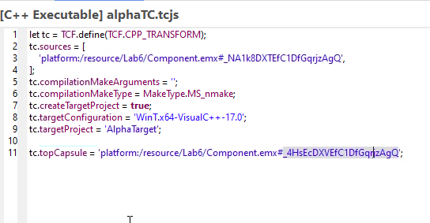

Save your work.

Right mouse click on the file `alphaTC.tcjs` and select build.

Once the build is done, you should see an `AlphaTarget project`

In your modeling project, open the `Transformation Configurations` folder and run the executable.

You should see this output

```console
RT C++ Target Run Time System - Release 8.0.10

targetRTS: observability listening not enabled
  Task 0 detached
I am Alpha
```

However, we did nothing to shut down this application; it is still sitting there patiently waiting for something to happen.
 

To shut it down, press the red square button on the console.

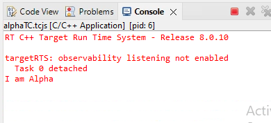

Notice that `Beta` didn't run.  Why?

## Part 4: Set up the `Beta` transformation.

First we need a new TC file.

### Generation method

Select the top level project folder, right mouse click on `New` the `Other`

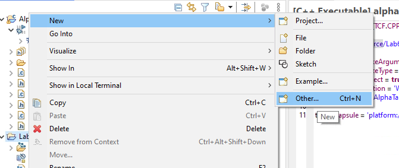

In the dialog box, scroll down until you see `Transformation Configuration`

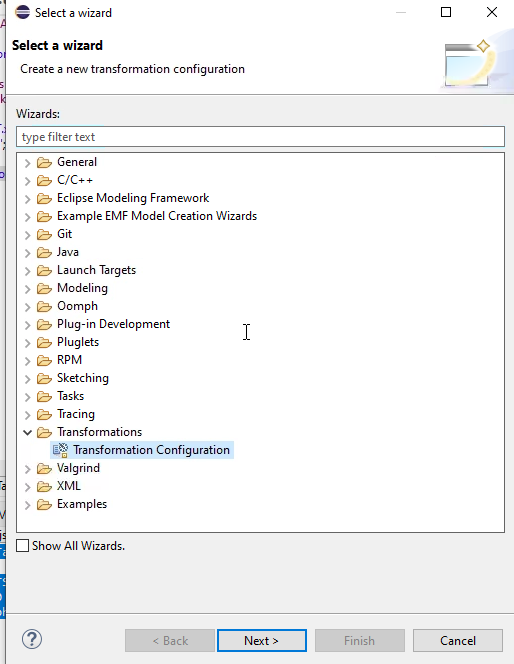

Select next and in the ext dialog box, provide a name for the TC, in this case `betaTC`.

We want the file in the main project directory so just leave that.

We also have to specify what type of transformation. 
- Since this will convert UML to C++, select that option as shown in the dialog box.

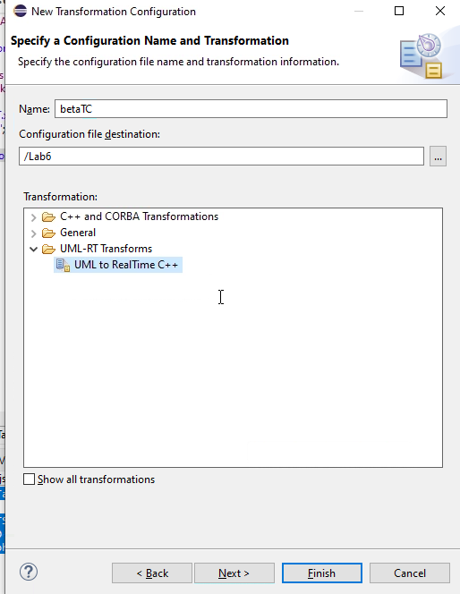

Select `Finish`

You should now see the file in your project explorer.

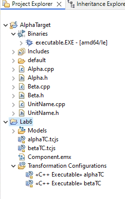

However, this is malformed since it doesn't have the hooks necessary to integrate with the model. 
- If we use this new file, the builds will start to fail because it can't find source files.
- Delete the file you just created 
- This part of the lab was just to explore the interface

### Alternate method

The `alphaTC.tcjs` file was created with the project and, as we saw with the build just done, it works.

In this case, copy the file and paste the copy back into the project and change its name to `betaTC.tcjs`

Now we just configure as follows


### Configure 

Just like you did before, open the file with the `Configuraton Transformation Editor`

In the `main` tab, specify a different directory for the output so we don't clash with the alpha project

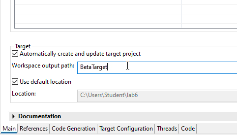

In the `target configuration` tab, set the same build tool options as for `alphaTC`

### Top Capsule

In the code tab, edit the top.capsule entry

**But be sure and replace the Alpha id with the Beta id from the text file where you recorded it**

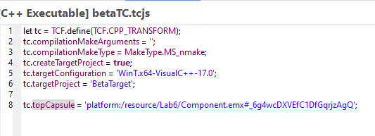

### Build

Just like you did before, right mouse click on the `betaTC.tc.js` file and select build

### Run 

Run this build the same way you did the other build.

Notice that this prints out 

```console
RT C++ Target Run Time System - Release 8.0.10

targetRTS: observability listening not enabled
  Task 0 detached
I am Beta

```

Use the red button to shut down

---

## Experiment

Since the first thing that both capsules do is to just print out their message, the question is why only the top capsule prints out a message?

Lets create a protocol and connect the two capsules

### Protocol

Create a protocol called `ack` with the same in and out event `ack`


Do the same as you did in Lab 3 with `Alpha` playing the part of `Receiver` and `Beta` playing the part of the `Sender.
 
Connect the ports. Notice we don't need conjugation (why?)

The final model looks like this:


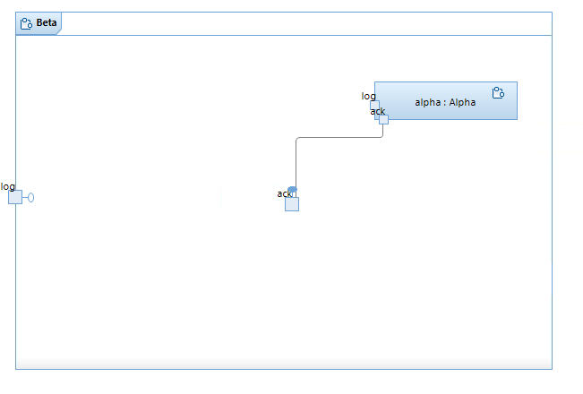

## Build

Build and run the alpha config

- Notice the output

```console
RT C++ Target Run Time System - Release 8.0.10

targetRTS: observability listening not enabled
  Task 0 detached
I am Alpha
```
- Use the red button to stop

Build and run the beta config

```console
RT C++ Target Run Time System - Release 8.0.10

targetRTS: observability listening not enabled
  Task 0 detached
I am Alpha
I am Beta

```

Can you explain why this happened?

Hint: Look at the structure diagram


## End Lab


