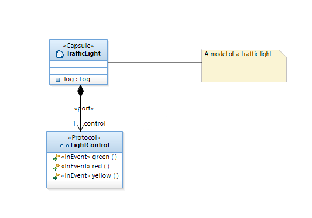
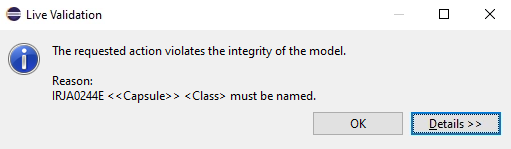
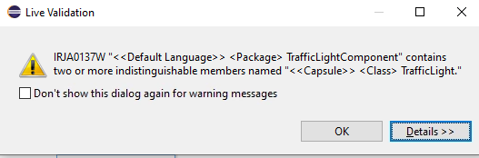
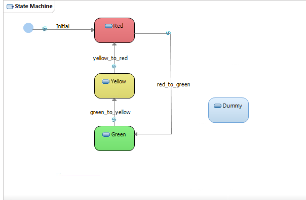
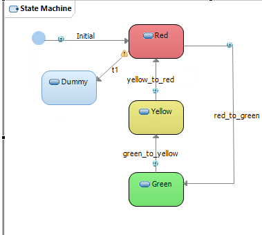
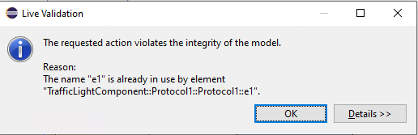
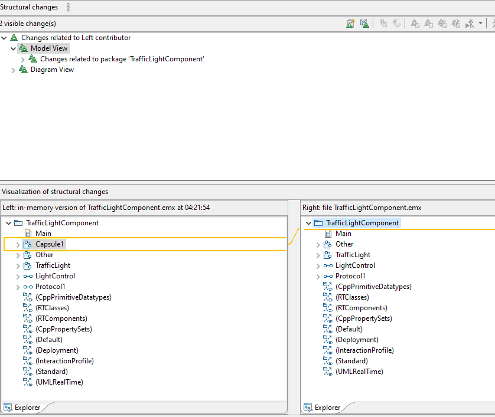

# Lab 07 Validation

In this lab, we are going to add model elements to the traffic light project to show how the validation rules work, then use the local history to compare versions

## Part One: Set up

- Create a new lab project called Lab7 that uses the traffic light template

Your start screen should look like this:

## Part Two: Validation Rules

### Missing name

- Create a new Capsule and leave the name blank
- Try to save the model, note the validation error

- Change the name to the same as the existing capsule "TrafficLight" and note the error when you try to save.

Note that the first is an error and the second is a warning. 
- This is a difference between what is called semantic validity and model hygiene 

- Ignore the warning and save.
- Then change the name back to "Other" and save

#### The Error

- The Name is required by the UML specification
- Every NamedElement in UML (including capsules, ports, states, classes) must have a non-empty name.
- RSARTE enforces this because:
  - Code generation requires it (you can't generate a C++ class or file with no name).
  - Diagrams and model references break without a name.

#### The Warning

- UML technically allows non-unique names
- UML's metamodel doesn't strictly require all names to be globally unique.
- Two capsules in different packages can have the same name.
- Even within a single package, RSARTE may allow it for flexibility (e.g., temporarily during rename/refactor).

But it's strongly discouraged because it causes:
- Ambiguity in diagrams
- Confusion in code generation
- Linkage errors in large models 
- Duplicate names are valid but dangerous — hence warnings, not hard errors.

### State Machine

- Open up the traffic light state machine.
- Add a new state called "Dummy"
- Do not add a transition.
- Save the model

Note that this does not create an error or warning.

#### Why It’s Allowed (and Not an Error)

UML Semantics Allow Orphaned States
- The UML specification does not require every state to have incoming or outgoing transitions.
- A state can legally exist without being connected — it's considered unused, but not invalid.

Design Time vs. Runtime
- An unconnected state doesn’t break model syntax or transformation.
- RSARTE treats it as a structurally valid but semantically meaningless element — something the modeler may still be working on.

Why It's Not a Warning Either (by Default)
- RSARTE's default validation rules are conservative — they avoid warning about situations that could be temporarily invalid during modeling.
- Many models are built iteratively, and disconnected states may be placeholders or partially constructed during design.

But It's Often a Design Problem
- Unreachable or disconnected states can lead to:
  - Dead code in generated state machine logic 
  - Misunderstood system behavior
  - Reduced maintainability

### Transition Warning

- Add a transition from the red state to your Dummy state
- Notice that there is a yellow warning triangle on one end
- Hover over it to notice that it tells you there is no trigger.

### Protocol Error

- Create a new protocol and add to InEvents with the same name. 
- This will be an error on save

However having an InEvent and an OutEvent of the same name is ok.  Why?

### Proactive Blocking

- Open up the state machine
- Select "Exit point" from the palette
- Notice that it will not let you place it on the state machine

## Part 3: Model Compare

#### With local file.

- Make a change in the model, like adding a capsule **but don't save it**
- Right click on `TrafficLightComponent` and way down at the bottom, select `Compare with` and `Local file`
- This will compare the in memory model with the one on disk

- Save the model and run it again. Now it shows no chantes

#### With History

- Right click and select the `Compare with` but this time with `Local history`

- You will see a list of all the revisions (saves) to the model ordered by time stamp

- Select one of the more recent versions, and you can see the difference between that model and the current one. 

### Model Reversion.

- Right click but select `Replace with` 
- There are two options
- The `previous from local history` reverts back to model you save prior to the current save
  - This has the effect of rolling back your last save
- You can also roll back to a previous version.

  