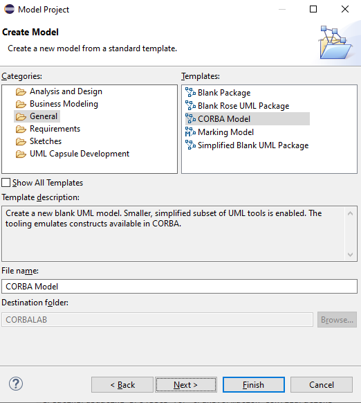

# Lab 08: Corba

This brief lab demonstrate using RSARTE to generate CORBA IDL components.

## Part 1: Set up

- Create a new modeling project called `CORBALAB`
- In the template section, select the `General` folder and select the `CORBA Model` option



- Rename the component to `HelloComponent` 
- This creates a structure with the structure shown.


## Part 2: Create Elements

- Under the component, add a UML package and name it `HelloModule`
- This represents a module
- Rename the default interface to `HelloService`


- Open `HelloService → Add UML -> Operation`
  - Name: sayHello
  - Return Type: String (select UML primitive type or create if missing)
  - Leave parameters empty


## Part 3: Transformation Configuration

- Right click on the project, and add a new transformation configuration like we did previously
- Give it a name, corbaTC
- Select the `UML to Corba IDL`


- Select `Next`

- Select the model file as the input and create a new target container, here named `IDL`


- Select `Finish`

## Part 4: Run the transformation

- Right click on the CORBA model, select transform and pick the run option as shown below


## Inspect 

The results are in the Target container (IDL) and a file called `HelloComponent.idl`

The content is 

```text
// File: HelloComponent.idl

#ifndef _HELLOCOMPONENT_IDL_
#define _HELLOCOMPONENT_IDL_
module HelloModule {
};
interface HelloService {
    string sayHello();
};

#endif /* #ifndef _HELLOCOMPONENT_IDL_ */

```