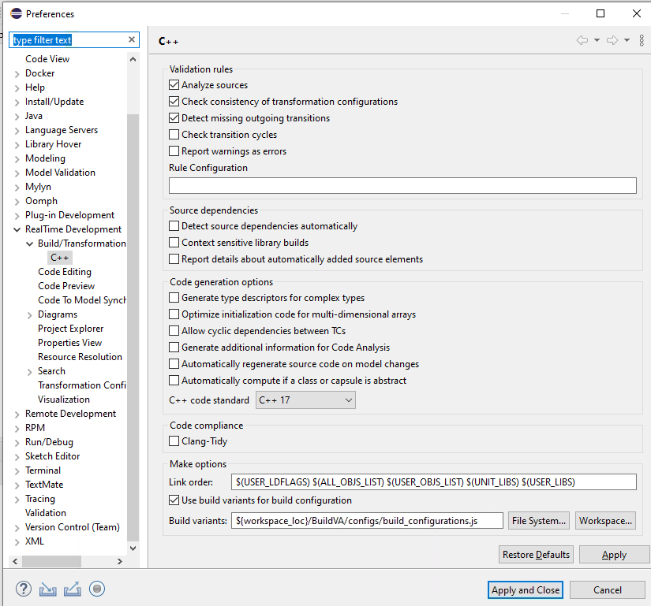
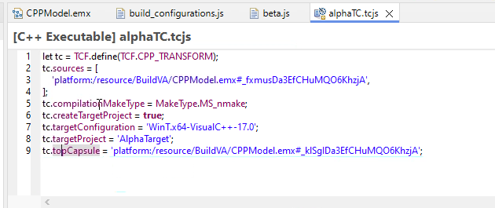
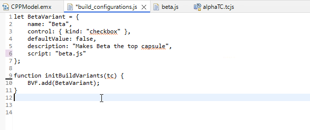
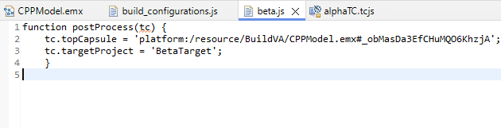
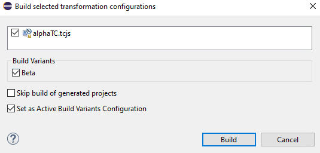

# Lab 09: Build Variants

This lab demonstrates the alternative approach to developing build variants

## Step 1: Set up

You can start with the project you create for the last built variants lab.

For this you don't need the second `betaTC.tcjs` configuration file.

You should have two capsules, Alpha and Beta.

If you don't have that lab or want to practice using the modeling tool, follow the instruction on creating the capsules from the previous lab.

## Step 2: Create build variant files

- Create a directory `configs` in the project to hold the build variant files
- Create a file called `build-configurations.js` in the directory
- Create a file called `beta.js` in the same directory
- You will add content to those files in another step

## Step 3: Configure

- The workspace has to be configured to run the variants.
- In the `Windows->Preferences-> Real Time Development -> Build/Transformation -> C/C++`
- Select the `Use build variants for build v=configutation` box
- Select the `Workspace` button and browse to add the file as shown below



- Select the `apply and close` button.

## Step 4: Main config

In the `alphaTc.js` file, confirm that you have the configuration that sets Alpha as the top capsule, and the AlphaTarget build directory



## Step 5: List variants.

In the `build_confgurations.js` file, open in a text editor and enter the code shown below

```text
let BetaVariant = {
    name: "Beta",
    control: { kind: "checkbox" },
    defaultValue: false,
    description: "Makes Beta the top capsule",
    script: "beta.js"  
};

function initBuildVariants(tc) {
    BVF.add(BetaVariant);
}

```



In the file `beta.js` add the following code

```text
function postProcess(tc) {
    tc.topCapsule = 'platform:/resource/BuildVA/CPPModel.emx#_obMasDa3EfCHuMQO6KhzjA';
    tc.targetProject = 'BetaTarget';
    }

```



What the beta.js script does is:
- Reset the value of `tc.topCapsule`
- Reset the value of `tc.targetProject`

## Step 6: Run the Alpha

- Right click on the `alphaTC.tcjs` file and select build.
- A dialog box will appear asking you if you want to build a variant.
- Make sure the check box is NOT checked.


- Run the build
- Execute the application and you should see

```console
RT C++ Target Run Time System - Release 8.0.10

targetRTS: observability listening not enabled
  Task 0 detached
Alpha
```

## Step 7: Run the Alpha

- Right click on the `alphaTC.tcjs` file and select build.
- A dialog box will appear asking you if you want to build a variant.
- Make sure the check box IS checked.



- Run the build
- Execute the application and you should see

```console
RT C++ Target Run Time System - Release 8.0.10

targetRTS: observability listening not enabled
  Task 0 detached
Beta
```

